# CVE Report Generator — Complete Guide

- **Documents:** [`cve_report.py`](cve_report.py) — a single-file Python 3 command-line tool (standard library only)
- **Companions:** [`find_module_new.py`](find_module_new.py) · [`configs/`](configs/) · [`README.md`](README.md) · [`.claude/commands/cve.md`](.claude/commands/cve.md)
- **Written against:** commit `7e38fe1` (2026-10-06). Function links in Appendix B point at line numbers of that version.

> **How to read this guide.** It is organised from beginner to advanced. You do not have to read it in
> order — pick the row in the table below that matches you.

| You are… | Start at | You will learn |
|---|---|---|
| Brand new, just want a report | [Part 1](#part-1--the-5-minute-overview-beginner) | What the tool is, how to run it, how to read its output |
| New to security jargon | [Part 2](#part-2--concepts-you-need-beginner--intermediate) | CVE, CVSS, CWE, EPSS, KEV, "dyad", "backport", `CONFIG_`… in plain words |
| Need to operate or install it | [Part 3](#part-3--architecture-and-dependencies-intermediate) | Architecture, dependencies, every data source, what happens when something is missing |
| Need to understand or modify the code | [Part 4](#part-4--code-walkthrough-intermediate) and [Part 5](#part-5--advanced-topics) | Function-by-function walkthrough, design decisions, extension recipes |
| Need to decide how far to trust it | [Part 6](#part-6--official-sources-and-reliability) | Which sources are official, how each can fail, how to verify any claim yourself |

> **About the diagrams.** Diagrams are written in [Mermaid](https://mermaid.js.org/). They render automatically on
> GitHub and GitLab. In VS Code, install the extension **Markdown Preview Mermaid Support**
> (`bierner.markdown-mermaid`) and open the Markdown preview.

---

## Contents

- [Part 1 — The 5-minute overview (Beginner)](#part-1--the-5-minute-overview-beginner)
- [Part 2 — Concepts you need (Beginner → Intermediate)](#part-2--concepts-you-need-beginner--intermediate)
- [Part 3 — Architecture and dependencies (Intermediate)](#part-3--architecture-and-dependencies-intermediate)
- [Part 4 — Code walkthrough (Intermediate)](#part-4--code-walkthrough-intermediate)
- [Part 5 — Advanced topics](#part-5--advanced-topics)
- [Part 6 — Official sources and reliability](#part-6--official-sources-and-reliability)
- [Part 7 — Advantages, limits and when to use what](#part-7--advantages-limits-and-when-to-use-what)
- [Appendix A — Command-line reference](#appendix-a--command-line-reference)
- [Appendix B — Function index](#appendix-b--function-index)
- [Appendix C — A real run, annotated](#appendix-c--a-real-run-annotated)
- [Appendix D — FAQ](#appendix-d--faq)

---

# Part 1 — The 5-minute overview (Beginner)

## 1.1 What is this tool?

`cve_report.py` takes **one vulnerability ID** (for example `CVE-2026-53359`) and produces **one report** about it.

To build that report it:

1. asks about 15 public websites and APIs what they know about the vulnerability,
2. works out **which Linux kernel versions are broken and which releases contain the fix**,
3. works out **which kernel module** (if any) contains the broken code, and — using your own kernel
   configuration files — whether that module is built for your kernels,
4. optionally asks an internal script **how many of your servers actually load that module**, and
5. writes everything up as a Markdown document.

It is built for **Linux-kernel CVEs** (the ones whose "assigner" is kernel.org). Other CVEs still produce a report,
but without the kernel-specific parts.

## 1.2 The problem it solves

| Question an analyst must answer | Doing it by hand | With the tool |
|---|---|---|
| What is the bug and how severe is it? | Open CVE.org, then NVD, compare scores | One table: "At a glance" |
| Is anyone exploiting it? | Check CISA's KEV list, FIRST EPSS, Exploit-DB | Same table |
| Which kernel versions are affected and which release fixes each branch? | Read git history, match commits to releases by hand | Per-branch fix table, built from the kernel team's own data |
| Which `.ko` module is it in, and is it compiled for our kernels? | Read Makefiles and Kconfig, check `.config` | Per-branch module table |
| Do any of our servers load that module? | Query the fleet inventory | "Fleet exposure" table |
| What do Debian / TuxCare / the press say? | Many browser tabs | Sections 8 and 9 |
| Where did each fact come from? | You remember (or not) | "Provenance" section + a console list of what was skipped and why |

## 1.3 Inputs and outputs

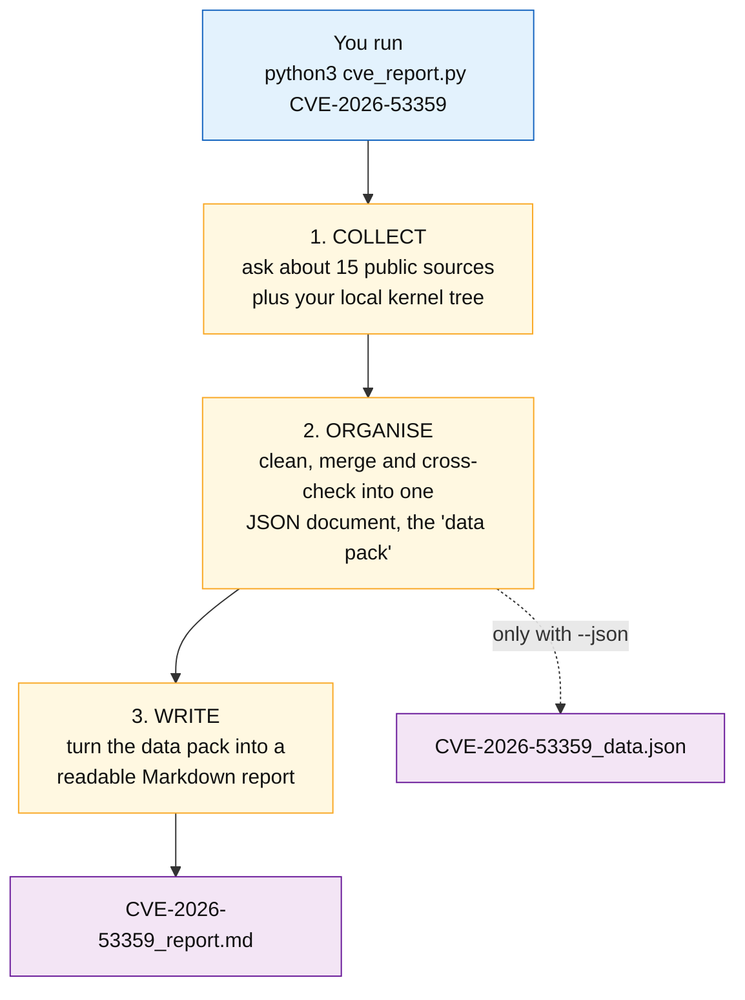
```mermaid
flowchart TD
    A["You run<br/>python3 cve_report.py CVE-2026-53359"]:::in --> B["1. COLLECT<br/>ask about 15 public sources<br/>plus your local kernel tree"]:::proc
    B --> C["2. ORGANISE<br/>clean, merge and cross-check into one<br/>JSON document, the 'data pack'"]:::proc
    C --> D["3. WRITE<br/>turn the data pack into a<br/>readable Markdown report"]:::proc
    D --> E["CVE-2026-53359_report.md"]:::out
    C -.->|"only with --json"| F["CVE-2026-53359_data.json"]:::out

    classDef in fill:#e3f2fd,stroke:#1565c0,color:#111
    classDef proc fill:#fff8e1,stroke:#f9a825,color:#111
    classDef out fill:#f3e5f5,stroke:#6a1b9a,color:#111
```

The **data pack** is the heart of the tool: a single JSON object holding every fact the tool found. The report is just
a human-friendly rendering of it. (Its full structure is in [section 5.2](#52-the-data-pack-schema).)

## 1.4 Your first run

**Requirements for the simplest run:** Python 3.7 or newer (the repo has been run with 3.12) and internet access.
Nothing needs to be installed — the script uses only Python's standard library.

```bash
cd CVE_Report

# Simplest run: no LLM, no internal tools, just public data (took ~27 s in a test)
python3 cve_report.py CVE-2026-53359 --template --no-module-resolve --no-module-stats

# Full run: LLM-written report + per-branch module table + fleet exposure
zllm start                                   # once, in another terminal
python3 cve_report.py CVE-2026-53359
```

Both write `CVE-2026-53359_report.md` in the current directory.

While it runs you will see progress lines on **stderr** (what each means is explained in
[Appendix C](#appendix-c--a-real-run-annotated)):

```text
[*] CVE-2026-53359: fetching cvelistV5 record ...
[*] fetching dyad / NVD / EPSS / KEV ...
[*] fetching Exploit-DB ...
...
  - not included: Per-branch module resolution (disabled (--no-module-resolve))
  - not included: Fleet module-usage stats (disabled (--no-module-stats))
[+] report written: CVE-2026-53359_report.md
```

> The lines starting with `- not included:` are deliberate: the tool tells you **which sources it did not use and why**,
> so a missing section is never a mystery.

## 1.5 Choosing a mode

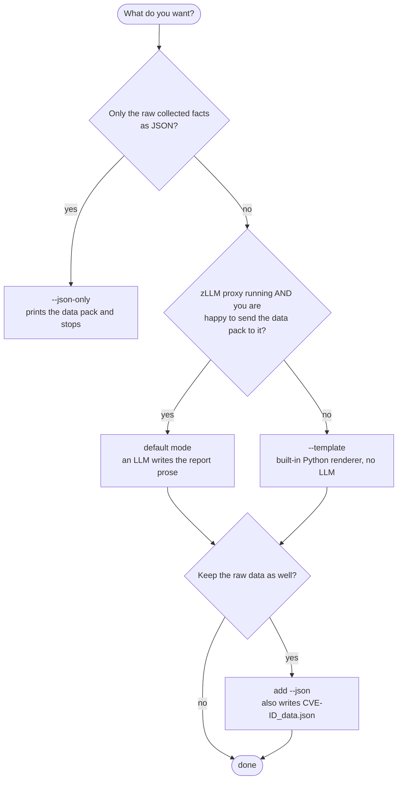
```mermaid
flowchart TD
    S(["What do you want?"]) --> Q1{"Only the raw collected facts<br/>as JSON?"}
    Q1 -->|yes| J["--json-only<br/>prints the data pack and stops"]
    Q1 -->|no| Q2{"zLLM proxy running AND you are<br/>happy to send the data pack to it?"}
    Q2 -->|yes| L["default mode<br/>an LLM writes the report prose"]
    Q2 -->|no| T["--template<br/>built-in Python renderer, no LLM"]
    L --> O{"Keep the raw data as well?"}
    T --> O
    O -->|yes| J2["add --json<br/>also writes CVE-ID_data.json"]
    O -->|no| Done(["done"])
    J2 --> Done
```

| Mode | Command | Needs the LLM proxy? | Output style |
|---|---|---|---|
| Default | `python3 cve_report.py CVE-…` | **Yes** — exits with an error if it is not reachable | Fluent prose written by the LLM from the data pack |
| Template | add `--template` | No | Fixed, fully predictable Markdown layout |
| Data only | add `--json-only` | No | The raw JSON data pack on stdout |
| Both | add `--json` | Depends on mode | Report **and** `CVE-…_data.json` |
| Preview | add `--stdout` | Depends on mode | Prints the report instead of writing a file |

> **"Template" is not "offline".** `--template` only means *no LLM*. Collecting the data still needs the internet.

## 1.6 What is inside a report

| # | Section | The question it answers | Mainly built from |
|---|---|---|---|
| 1 | **At a glance** | How bad, how likely to be exploited, is it being exploited? | CVE record, NVD, EPSS, CISA KEV/SSVC, Exploit-DB |
| 2 | **Affected component** | Which subsystem / file / function / module / `CONFIG_` option? | CVE record, commit diff, Makefiles, local tree + `.config` files |
| 3 | **Affected & fixed versions** | Since when is it broken? Which release fixes each branch? Which branches will never get a fix? | kernel.org **dyad** file, commit dates |
| 3b | **Fleet exposure** | Is the module built-in, not loaded anywhere, or loaded on N servers per region? | `find_module_new.py`, `module_stats.py` |
| 4 | **Vulnerability details** | What is the weakness? Upstream description; TuxCare status | CVE record, CWE, TuxCare |
| 5 | **The fix** | Which commit, by whom, when, how big, backports per branch? | git (local or git.kernel.org) |
| 6 | **Mitigations & detection** | What should I do? | Derived from the above |
| 7 | **References** | Where are the primary documents? | CVE record, NVD, discussion lists |
| 8 | **Debian** | Is Debian fixed, per suite? | Debian Security Tracker |
| 9 | **Media & community coverage** | Has anyone written about it? | Feedly, Hacker Wire, news sites |
| 10 | **Provenance** | Which sources were used, when was it generated? | The tool itself |

The Red Hat, Ubuntu, SUSE, Arch and OSV sections are **deliberately not rendered** (see [section 5.8](#58-known-quirks-and-limitations-of-the-current-code)).

## 1.7 The ten flags you will actually use

| Flag | What it does |
|---|---|
| `-o FILE` | Write the report to `FILE` instead of `<CVE>_report.md` |
| `--stdout` | Print the report; write no report file |
| `--template` | Skip the LLM, use the built-in renderer |
| `--json` / `--json-only` | Also save the data pack / print only the data pack |
| `--no-diff` | Do not fetch commit patches (faster, loses dates, authors, functions) |
| `--no-vendor` | Skip Exploit-DB, Debian, linuxkernelcves, TuxCare |
| `--no-media` | Skip Feedly, Hacker Wire and the three news sites |
| `--no-module-resolve` | Skip the per-branch module table (the slowest optional step) |
| `--no-module-stats` | Skip the fleet-exposure lookup |
| `--linux-src PATH` / `--configs-dir PATH` | Point at your Linux clone / your `config-*` files |

The complete list is in [Appendix A](#appendix-a--command-line-reference).

---

# Part 2 — Concepts you need (Beginner → Intermediate)

## 2.1 Vulnerability vocabulary

| Term | Plain-language meaning | Where it shows up in this tool |
|---|---|---|
| **CVE** | A unique ID for one publicly known vulnerability, format `CVE-YEAR-NUMBER`. | The tool's only input. Validated by the regex `^CVE-\d{4}-\d{4,}$`. |
| **CNA** (CVE Numbering Authority) | An organisation allowed to assign CVE IDs and write the official record. **kernel.org is a CNA** and writes almost all Linux-kernel CVEs. | `assignerShortName == "linux"` is how the tool decides a CVE is a *kernel CVE* (`is_kernel`). |
| **CVE record** | The official JSON document describing a CVE. Contains a `cna` block (written by the CNA) and optional `adp` blocks (added by other authorised publishers). | Fetched first; everything else builds on it. |
| **ADP** (Authorized Data Publisher) | A third party allowed to *add* data to someone else's record. CISA's ADP adds severity, CWE and SSVC. | `parse_cvss`, `parse_cwe`, `parse_ssvc` read `containers.adp[]`. |
| **cvelistV5** | The public GitHub repository holding every CVE record as a JSON file. | Primary source (raw file URL). |
| **CVSS** | A 0–10 score of *technical* severity, plus a **vector string** that records how it was computed. | "CVSS" row. See decoder below. |
| **CWE** | A catalogue of *kinds* of software weakness, e.g. CWE-416 = Use After Free. | "Weakness" row. |
| **EPSS** | A probability (0–1) that a CVE will be exploited in the wild in the next 30 days, plus a percentile rank among all CVEs. Published by FIRST. | "EPSS" row. |
| **KEV** | CISA's *Known Exploited Vulnerabilities* catalogue: CVEs with evidence of **real exploitation**. | "CISA KEV" row. |
| **SSVC** | CISA's decision-tree labels: *Exploitation* (`none`/`poc`/`active`), *Automatable* (`yes`/`no`), *Technical impact* (`partial`/`total`). | "CISA SSVC" row. |
| **NVD** | The US National Vulnerability Database (NIST). Takes CVE records and adds scoring and analysis. | "NVD status" row; extra CVSS/CWE/CPE/references. |
| **CPE** | A machine-readable name for a product and version range. | "Vulnerable version ranges (CPE)". |
| **PoC / exploit** | Code that demonstrates / abuses the bug. | Exploit-DB lookup. |

**Severity bands** (what `_sev_from_score` implements when a source gives only a number):

| Score | Label |
|---|---|
| 0.0 | NONE |
| 0.1 – 3.9 | LOW |
| 4.0 – 6.9 | MEDIUM |
| 7.0 – 8.9 | HIGH |
| 9.0 – 10.0 | CRITICAL |

**Decoding a CVSS vector** — the real one from the sample run, `CVSS:3.1/AV:L/AC:L/PR:L/UI:N/S:C/C:H/I:H/A:H` → **8.8 HIGH**:

| Part | Meaning |
|---|---|
| `AV:L` | Attack Vector: **L**ocal (attacker needs local access) |
| `AC:L` | Attack Complexity: **L**ow |
| `PR:L` | Privileges Required: **L**ow (an ordinary account) |
| `UI:N` | User Interaction: **N**one |
| `S:C` | Scope: **C**hanged (can affect beyond the vulnerable component, e.g. guest → host) |
| `C:H` `I:H` `A:H` | Confidentiality / Integrity / Availability impact: all **H**igh |

> **CVSS is severity, not risk.** A high CVSS on a module you never load is low risk for you. That is exactly why this
> tool also reports EPSS, KEV and *fleet exposure*.

**NVD processing states** (the `vulnStatus` field the tool prints as "NVD status"; simplified):

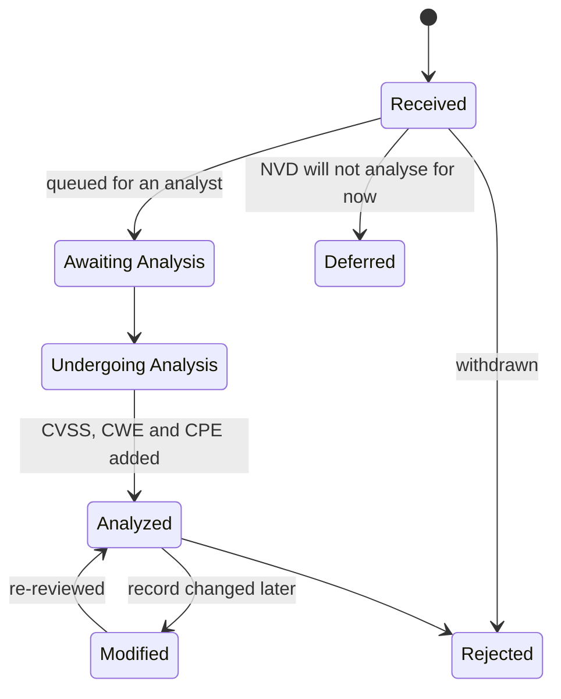
```mermaid
stateDiagram-v2
    state "Awaiting Analysis" as AA
    state "Undergoing Analysis" as UA
    [*] --> Received
    Received --> AA: queued for an analyst
    AA --> UA
    UA --> Analyzed: CVSS, CWE and CPE added
    Analyzed --> Modified: record changed later
    Modified --> Analyzed: re-reviewed
    Received --> Deferred: NVD will not analyse for now
    Received --> Rejected: withdrawn
    Analyzed --> Rejected
```

A CVE in state `Received` (like `CVE-2026-80844` in the repo's sample data) has **no NVD score and no NVD CWE yet**.
That is normal, not an error — the report simply shows what the CNA supplied.

## 2.2 Linux-kernel vocabulary

| Term | Plain-language meaning |
|---|---|
| **Mainline** | Linus Torvalds's main development tree. New features and the *first* version of every fix land here. |
| **Stable branch** (`6.12.y`) | A long-lived branch that receives only bug fixes. Releases on it look like `6.12.95`. The tool derives the branch from a release with `_branch_of("6.12.95") → "6.12.y"`. |
| **Commit** | One recorded change, identified by a 40-hex-digit hash (often shown as the first 12). |
| **Backport** | Copying a mainline fix onto an older stable branch. Each backport is a *different commit* with a *different hash*. |
| **Introduced / fixed** | The commit that created the bug vs. the commit that repaired it. |
| **EOL branch** | A branch that is no longer maintained. If it was vulnerable, it will **never** be fixed. The tool lists these as "affected but not fixed". |
| **Dyad** | A pair `(vulnerable commit/release, fixed commit/release)`. The kernel CNA publishes one `.dyad` file per CVE listing all pairs. |
| **Subsystem** | A major area of the kernel (KVM, netfilter, ext4…). The commit title usually starts with it: `KVM: x86: Fix …`. |
| **Kernel module (`.ko`)** | Code compiled as a separately loadable file. Present on a running system only if loaded (`lsmod`). |
| **Built-in (`vmlinux`)** | Code compiled **into** the kernel image itself. Always present; there is nothing to "not load". |
| **Kconfig / `.config` / `CONFIG_FOO`** | Build-time switches. `CONFIG_FOO=y` → built-in, `=m` → module, *not set* → not compiled at all. |
| **Makefile `obj-$(CONFIG_FOO) += foo.o`** | The line that ties a source file to a `CONFIG_` switch. The tool reads these to answer "which module is this `.c` file part of?" |
| **git worktree** | An extra checkout of the same repository in another folder, sharing history. The tool makes throw-away ones to read each branch's Makefiles without disturbing your clone. |
| **Diff / hunk** | A diff is a list of changes. Each *hunk* starts with a header like `@@ -120,7 +120,9 @@ some_function(...)`. |
| **Diffstat** | Summary of a patch: "+6 / −4 across 1 file". |

## 2.3 The life of a kernel vulnerability — and where each source learns about it

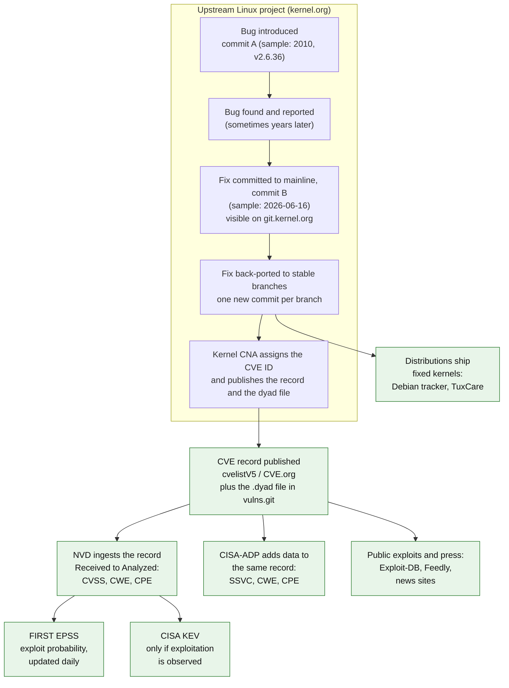
```mermaid
flowchart TD
    subgraph UP["Upstream Linux project (kernel.org)"]
        B1["Bug introduced<br/>commit A (sample: 2010, v2.6.36)"] --> B2["Bug found and reported<br/>(sometimes years later)"]
        B2 --> B3["Fix committed to mainline, commit B<br/>(sample: 2026-06-16)<br/>visible on git.kernel.org"]
        B3 --> B4["Fix back-ported to stable branches<br/>one new commit per branch"]
        B4 --> B5["Kernel CNA assigns the CVE ID<br/>and publishes the record and the dyad file"]
    end
    B5 --> REC["CVE record published<br/>cvelistV5 / CVE.org<br/>plus the .dyad file in vulns.git"]:::tool
    REC --> N1["NVD ingests the record<br/>Received to Analyzed:<br/>CVSS, CWE, CPE"]:::tool
    REC --> N2["CISA-ADP adds data to<br/>the same record:<br/>SSVC, CWE, CPE"]:::tool
    REC --> M1["Public exploits and press:<br/>Exploit-DB, Feedly,<br/>news sites"]:::tool
    N1 --> R1["FIRST EPSS<br/>exploit probability,<br/>updated daily"]:::tool
    N1 --> R2["CISA KEV<br/>only if exploitation<br/>is observed"]:::tool
    B4 --> V1["Distributions ship<br/>fixed kernels:<br/>Debian tracker, TuxCare"]:::tool

    classDef tool fill:#e8f5e9,stroke:#2e7d32,color:#111
```

Green boxes are the places `cve_report.py` reads. The point of the diagram: **no single place has the whole story**. The CVE record has the text but not the per-branch
releases; the dyad file has the releases but not the score; NVD has the score later; EPSS and KEV are separate
feeds; distros have their own status. The tool's job is to join them.

## 2.4 Programming concepts used by the tool

| Concept | Meaning | Where it appears |
|---|---|---|
| **REST API / JSON** | Ask a URL, get structured data back. | NVD, EPSS, cveawg, OSV, Red Hat, Arch, WordPress `/wp-json/`, Blogger feeds |
| **Bulk dump** | No per-item API; download one big file and search it locally. | CISA KEV, Debian tracker, linuxkernelcves.com |
| **Scraping** | Pulling data out of a web page meant for humans. Fragile. | TuxCare (regex over HTML) |
| **Embedded structured data** | A page that carries a machine-readable JSON block inside its HTML. More robust than prose scraping. | Feedly (`__NEXT_DATA__`), Hacker Wire (`ld+json`) |
| **HTTP status codes** | `200` ok · `404` "no such thing" (often normal here) · `403/429/503` "slow down / try later". | `_http` retry logic |
| **Retry with back-off** | Try again after a growing pause. | `_http` |
| **TTL cache** | Keep a downloaded file for *N* hours before re-downloading. | `_cached` |
| **Fallback chain** | Try source A; if unusable, source B. | `fetch_cvelist`, `parse_cwe`, `fetch_patch` |
| **Graceful degradation** | If an optional piece is missing, produce the report without it. | Almost everything except the CVE record and the LLM |
| **Regular expression (regex)** | A text-matching pattern. | Parsing dyad files, patches, Makefiles, HTML |
| **Subprocess** | Running another program (`git`, `module_stats.py`). | `_fetch_patch_local`, `fetch_module_stats` |
| **LLM / OpenAI-compatible API** | A language model reached through `POST /chat/completions` with a *system prompt* (rules) and a *user message* (task + data). | `llm_chat`, `render_markdown_llm` |
| **Grounding** | Forcing an LLM to use only supplied facts. | The system prompt: "Use ONLY the facts present in that JSON" |
| **Temperature** | Randomness of LLM output (0 = most deterministic). The tool uses `0.2`. | `llm_chat` |

---

# Part 3 — Architecture and dependencies (Intermediate)

## 3.1 Architecture at a glance

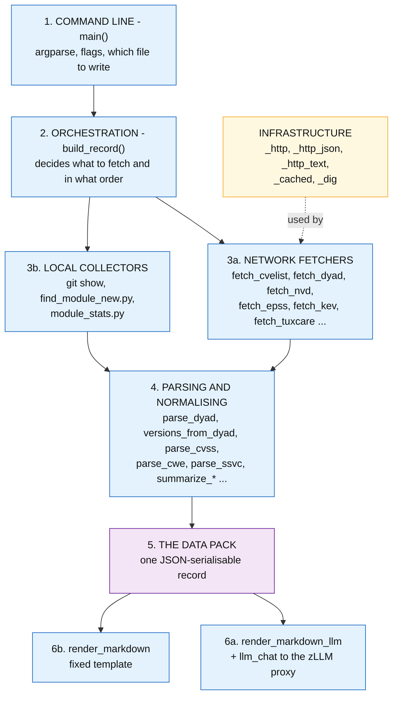
```mermaid
flowchart TB
    MAIN["1. COMMAND LINE - main()<br/>argparse, flags, which file to write"]:::l
    BR["2. ORCHESTRATION - build_record()<br/>decides what to fetch and in what order"]:::l
    NET["3a. NETWORK FETCHERS<br/>fetch_cvelist, fetch_dyad, fetch_nvd,<br/>fetch_epss, fetch_kev, fetch_tuxcare ..."]:::l
    LOC["3b. LOCAL COLLECTORS<br/>git show, find_module_new.py,<br/>module_stats.py"]:::l
    INF["INFRASTRUCTURE<br/>_http, _http_json, _http_text,<br/>_cached, _dig"]:::i
    PAR["4. PARSING AND NORMALISING<br/>parse_dyad, versions_from_dyad, parse_cvss,<br/>parse_cwe, parse_ssvc, summarize_* ..."]:::l
    REC["5. THE DATA PACK<br/>one JSON-serialisable record"]:::d
    LLM["6a. render_markdown_llm<br/>+ llm_chat to the zLLM proxy"]:::l
    TPL["6b. render_markdown<br/>fixed template"]:::l
    MAIN --> BR
    BR --> NET
    BR --> LOC
    INF -.->|"used by"| NET
    NET --> PAR
    LOC --> PAR
    PAR --> REC
    REC --> LLM
    REC --> TPL

    classDef l fill:#e3f2fd,stroke:#1565c0,color:#111
    classDef i fill:#fff8e1,stroke:#f9a825,color:#111
    classDef d fill:#f3e5f5,stroke:#6a1b9a,color:#111
```

Design in one sentence: **collect → normalise → one JSON record → render**. Because rendering only ever sees the
JSON record, you can swap or add renderers without touching any fetcher.

## 3.2 How the file is organised

The source file is divided by banner comments. Reading it top to bottom follows the same order as a run.

| Banner in the file | Contents | Role |
|---|---|---|
| Module docstring | Usage, source list, env vars | Human documentation |
| `Constants` | URLs, cache path, defaults, the LLM prompts, `CWE_KEYWORDS` | Configuration in code |
| `HTTP helpers` | `_http`, `_http_json`, `_http_text`, `llm_chat`, `_cached` | Network + cache plumbing |
| `URL helpers` | `_cve_parts`, `cvelist_url`, `cvelist_blob_url` | Build the CVE-list URL |
| `Source fetchers` | `fetch_*`, patch parsing, Makefile/module helpers | One function per source |
| `Small utils` | `_dig`, `_sev_from_score`, `_branch_of`, `classify_cwe` | Helpers |
| `Parsing` | `parse_*`, `versions_*`, `summarize_*`, `categorize_refs`, … | Raw → normalised |
| `Build record` | `build_record` | The orchestrator |
| `Rendering` | `_slim_*`, `render_markdown_llm`, `render_markdown` | Record → Markdown |
| `Main` | `main` | CLI entry point |

## 3.3 The pipeline in two halves

### Half 1 — collecting

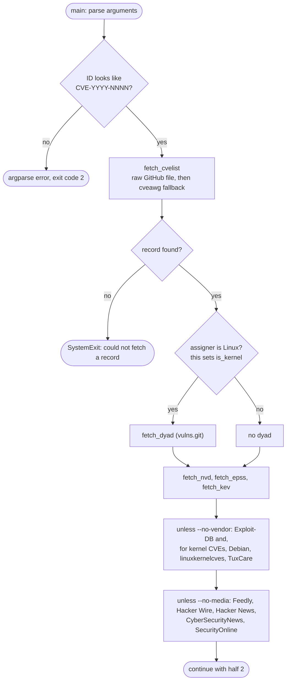
```mermaid
flowchart TD
    A(["main: parse arguments"]) --> B{"ID looks like<br/>CVE-YYYY-NNNN?"}
    B -->|no| X1(["argparse error, exit code 2"])
    B -->|yes| C["fetch_cvelist<br/>raw GitHub file, then cveawg fallback"]
    C --> D{"record found?"}
    D -->|no| X2(["SystemExit: could not fetch a record"])
    D -->|yes| E{"assigner is Linux?<br/>this sets is_kernel"}
    E -->|yes| F["fetch_dyad (vulns.git)"]
    E -->|no| G["no dyad"]
    F --> H["fetch_nvd, fetch_epss, fetch_kev"]
    G --> H
    H --> J["unless --no-vendor: Exploit-DB and,<br/>for kernel CVEs, Debian, linuxkernelcves, TuxCare"]
    J --> M["unless --no-media: Feedly, Hacker Wire, Hacker News,<br/>CyberSecurityNews, SecurityOnline"]
    M --> O(["continue with half 2"])
```

### Half 2 — enriching and writing (three parts)

**2a. Interpreting the record, patches and functions**

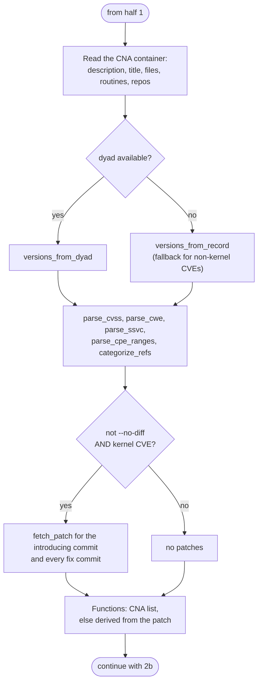
```mermaid
flowchart TD
    A(["from half 1"]) --> B["Read the CNA container:<br/>description, title, files, routines, repos"]
    B --> C{"dyad available?"}
    C -->|yes| D["versions_from_dyad"]
    C -->|no| E["versions_from_record<br/>(fallback for non-kernel CVEs)"]
    D --> F["parse_cvss, parse_cwe, parse_ssvc,<br/>parse_cpe_ranges, categorize_refs"]
    E --> F
    F --> G{"not --no-diff<br/>AND kernel CVE?"}
    G -->|yes| H["fetch_patch for the introducing commit<br/>and every fix commit"]
    G -->|no| I["no patches"]
    H --> J["Functions: CNA list,<br/>else derived from the patch"]
    I --> J
    J --> K(["continue with 2b"])
```

**2b. Modules and fleet exposure**

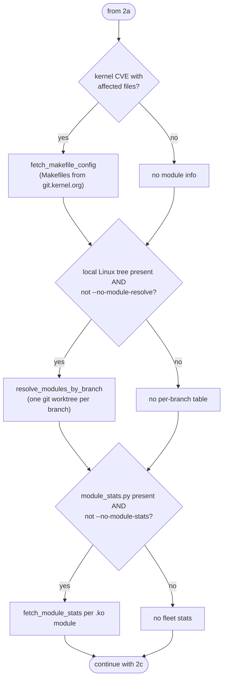
```mermaid
flowchart TD
    A(["from 2a"]) --> K{"kernel CVE with<br/>affected files?"}
    K -->|yes| L["fetch_makefile_config<br/>(Makefiles from git.kernel.org)"]
    K -->|no| M["no module info"]
    L --> N{"local Linux tree present AND<br/>not --no-module-resolve?"}
    M --> N
    N -->|yes| O["resolve_modules_by_branch<br/>(one git worktree per branch)"]
    N -->|no| P["no per-branch table"]
    O --> Q{"module_stats.py present AND<br/>not --no-module-stats?"}
    P --> Q
    Q -->|yes| R["fetch_module_stats per .ko module"]
    Q -->|no| S["no fleet stats"]
    R --> T(["continue with 2c"])
    S --> T
```

**2c. Assembling and writing**

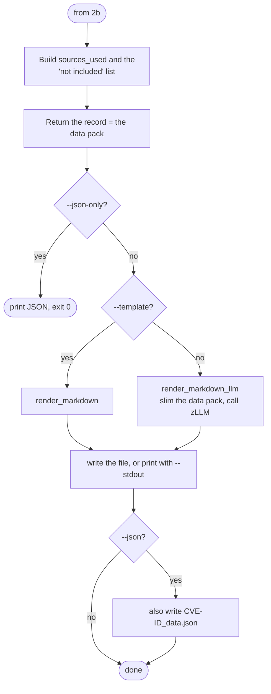
```mermaid
flowchart TD
    A(["from 2b"]) --> T["Build sources_used and the<br/>'not included' list"]
    T --> U["Return the record = the data pack"]
    U --> V{"--json-only?"}
    V -->|yes| W(["print JSON, exit 0"])
    V -->|no| X{"--template?"}
    X -->|yes| Y["render_markdown"]
    X -->|no| Z["render_markdown_llm<br/>slim the data pack, call zLLM"]
    Y --> AA["write the file, or print with --stdout"]
    Z --> AA
    AA --> AB{"--json?"}
    AB -->|yes| AC["also write CVE-ID_data.json"]
    AB -->|no| AD(["done"])
    AC --> AD
```

## 3.4 One run as a conversation

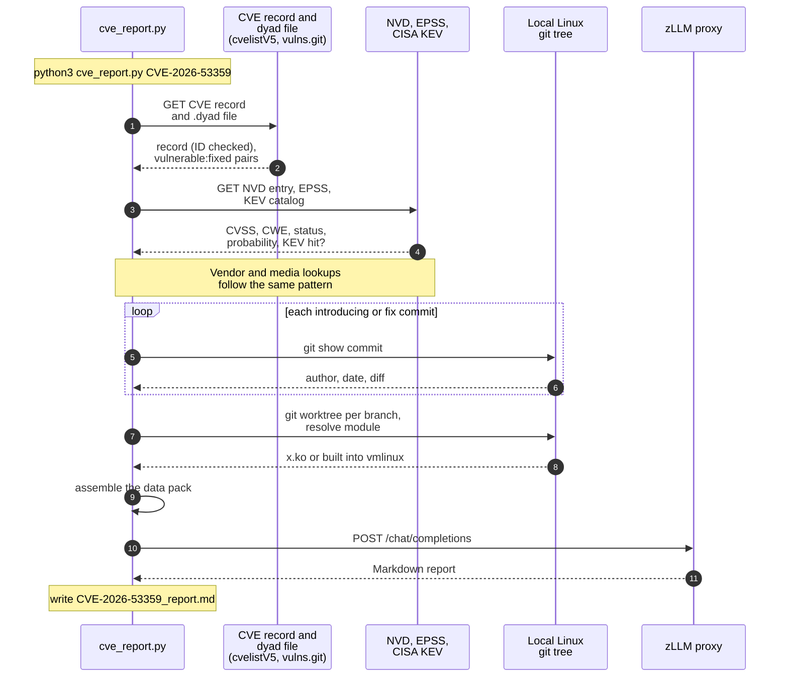
```mermaid
sequenceDiagram
    autonumber
    participant S as cve_report.py
    participant CV as CVE record and<br/>dyad file<br/>(cvelistV5, vulns.git)
    participant PUB as NVD, EPSS,<br/>CISA KEV
    participant LG as Local Linux<br/>git tree
    participant LL as zLLM proxy

    Note over S: python3 cve_report.py CVE-2026-53359
    S->>CV: GET CVE record<br/>and .dyad file
    CV-->>S: record (ID checked),<br/>vulnerable:fixed pairs
    S->>PUB: GET NVD entry, EPSS,<br/>KEV catalog
    PUB-->>S: CVSS, CWE, status,<br/>probability, KEV hit?
    Note over S,PUB: Vendor and media lookups<br/>follow the same pattern
    loop each introducing or fix commit
        S->>LG: git show commit
        LG-->>S: author, date, diff
    end
    S->>LG: git worktree per branch,<br/>resolve module
    LG-->>S: x.ko or built into vmlinux
    S->>S: assemble the data pack
    S->>LL: POST /chat/completions
    LL-->>S: Markdown report
    Note over S: write CVE-2026-53359_report.md
```

## 3.5 Dependencies

### What is required and what is optional

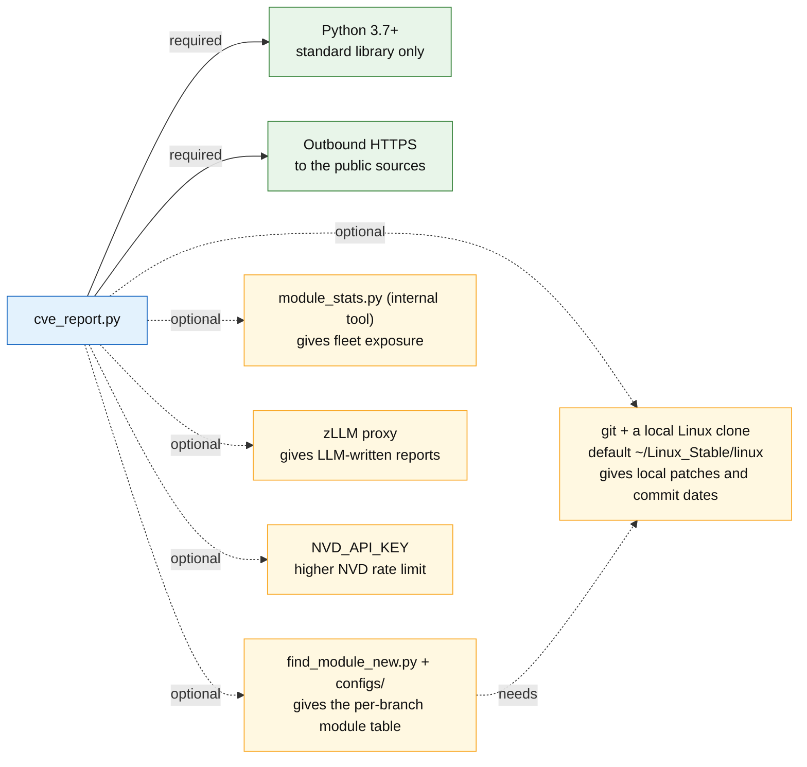
```mermaid
flowchart LR
    TOOL["cve_report.py"]:::tool
    PY["Python 3.7+<br/>standard library only"]:::req
    NET["Outbound HTTPS<br/>to the public sources"]:::req
    GIT["git + a local Linux clone<br/>default ~/Linux_Stable/linux<br/>gives local patches and commit dates"]:::opt
    FM["find_module_new.py + configs/<br/>gives the per-branch module table"]:::opt
    MS["module_stats.py (internal tool)<br/>gives fleet exposure"]:::opt
    ZL["zLLM proxy<br/>gives LLM-written reports"]:::opt
    KEY["NVD_API_KEY<br/>higher NVD rate limit"]:::opt
    TOOL -->|"required"| PY
    TOOL -->|"required"| NET
    TOOL -.->|"optional"| GIT
    TOOL -.->|"optional"| FM
    TOOL -.->|"optional"| MS
    TOOL -.->|"optional"| ZL
    TOOL -.->|"optional"| KEY
    FM -.->|"needs"| GIT

    classDef tool fill:#e3f2fd,stroke:#1565c0,color:#111
    classDef req fill:#e8f5e9,stroke:#2e7d32,color:#111
    classDef opt fill:#fff8e1,stroke:#f9a825,color:#111
```

### Python standard-library modules

| Module | Used for |
|---|---|
| `argparse` | Command-line flags |
| `urllib.request`, `urllib.error`, `urllib.parse` | All HTTP (GET for data, POST for the LLM), URL quoting |
| `json` | Parse API responses; build the data pack and the LLM request |
| `re` | Pattern matching: dyad lines, patch headers, Makefiles, HTML blocks, CVE-ID validation |
| `os`, `sys` | Paths, environment variables, stderr, exit codes |
| `subprocess` | Running `git show` and `module_stats.py` (always as an argument list, never through a shell) |
| `time` | Retry sleeps and cache age |
| `gzip` | Decompressing gzip responses (in practice the Debian dump, the only request that asks for gzip) |
| `datetime` | UTC generation timestamp, date formatting |
| `__future__.annotations` | Modern type-hint behaviour (this is what sets the 3.7+ floor) |

`find_module_new.py` (imported lazily, only when module resolution runs) additionally uses `concurrent.futures`,
`shutil`, `tempfile` and `uuid` — all standard library as well.

### Non-Python things the tool talks to

| Dependency | Needed for | If missing |
|---|---|---|
| **Internet** (HTTPS, outbound) | All data sources | A source that cannot be reached is skipped with a stderr note; if the **CVE record** cannot be fetched the run stops |
| **`git`** executable | Local patch reading; `find_module_new.py` worktrees | Patches fall back to git.kernel.org; module resolution is skipped |
| **Linux clone** at `--linux-src` (default `~/Linux_Stable/linux`) with **local branches** `linux-5.10.y`, `linux-6.1.y`, `linux-6.12.y` | Local patches; module resolution | Patches fetched remotely; no per-branch module table |
| **`configs/config-<major.minor>.<patch>`** files (e.g. `config-6.12.90`) | Choosing which `.config` to test each branch against | A branch with no matching config is silently skipped |
| **`find_module_new.py`** next to the script | The Makefile/Kconfig resolution engine | `ImportError` is caught; module resolution silently returns nothing |
| **`module_stats.py`** (`--module-stats-script`) | Fleet exposure | Skipped; reason logged |
| **zLLM proxy** at `ZLLM_BASE_URL` | LLM-written report | Run **stops** with an error and the hint `zllm start` — *by design there is no silent fallback*; use `--template` |

### Environment variables

| Variable | Default | Purpose |
|---|---|---|
| `NVD_API_KEY` | none | Sent as the `apiKey` header to NVD to raise its rate limit |
| `ZLLM_BASE_URL` | `http://127.0.0.1:8787/v1` | Where the OpenAI-compatible proxy listens |
| `ZLLM_API_KEY` | `unused` | Sent as `Authorization: Bearer …` (the proxy ignores it unless configured) |
| `ZLLM_MODEL` | `gpt-5.4` | Model id sent to the proxy (`--llm-model` overrides) |
| `TMPDIR` | `/tmp` | Parent of the cache folder and of the temporary worktrees |

### Network hosts to allow through a firewall

`raw.githubusercontent.com`, `cveawg.mitre.org`, `git.kernel.org`, `services.nvd.nist.gov`, `api.first.org`,
`www.cisa.gov`, `security-tracker.debian.org`, `www.exploit-db.com`, `tuxcare.com`, `feedly.com`,
`www.thehackerwire.com`, `thehackernews.com`, `cybersecuritynews.com`, `securityonline.info`
— plus the LLM proxy (local by default).

## 3.6 Catalogue of data sources

| # | Source | Run by | What the tool takes from it | Interface | Cached |
|---|---|---|---|---|---|
| 1 | **CVEProject/cvelistV5** (raw file on GitHub) | The CVE Program | The CVE record: title, description, files, functions, CNA/ADP CVSS, CWE, SSVC, CPE ranges, references | Raw JSON file by path | No |
| 1b | **cveawg.mitre.org** (CVE Services API) | The CVE Program | Same record, used as a **fallback** | REST JSON | No |
| 2 | **kernel vulns.git `.dyad`** | kernel.org CNA team | Vulnerable → fixed commit/release pairs per branch; unfixed (EOL) branches | Plain text over git web | No |
| 3 | **NVD 2.0 API** | NIST | CVSS, CWE, `vulnStatus`, extra references | REST JSON (optional API key) | No |
| 4 | **FIRST EPSS API** | FIRST.org | Exploit probability and percentile | REST JSON | No |
| 5 | **CISA KEV catalogue** | CISA | "Known exploited?" plus due date | One JSON file, searched locally | **6 h** |
| 6 | **git.kernel.org** (stable tree) | kernel.org | Patches (fallback to local tree); directory `Makefile`s | Plain text over git web | No |
| 7 | **Local Linux clone** | You | Patches via `git show`, **commit dates**, branch Makefiles/Kconfig | `git` subprocess | — |
| 8 | **`find_module_new.py` + `configs/`** | You | File → module/built-in/not-compiled, per branch | Python import | — |
| 9 | **`module_stats.py`** | Your fleet team | Per-region counts of servers loading the module | Subprocess, text table | — |
| 10 | **Debian Security Tracker** | Debian project | Per-suite status and fixed package version | One big JSON dump, searched locally | **24 h** |
| 11 | **TuxCare CVE tracker** | TuxCare (commercial vendor) | Debian ELS fixes and KernelCare (live-patch) state | HTML page, regex extraction | No |
| 12 | **Exploit-DB** | OffSec | Public exploit entries | Undocumented search endpoint (JSON) | No |
| 13 | **linuxkernelcves.com data** | Community (`nluedtke`) | Colloquial name (e.g. "Dirty Pipe"), affected / last-vulnerable versions | One ~6 MB JSON file | **24 h** |
| 14 | **Feedly** `/cve/<id>` | Feedly (commercial) | Trending flag, mention count, up to 5 article links | JSON embedded in HTML | No |
| 15 | **The Hacker Wire** | Third-party site | Per-CVE headline/description | `ld+json` block embedded in HTML | No |
| 16 | **The Hacker News** | Third-party news site | Up to 3 article hits | Blogger public feed | No |
| 17 | **CyberSecurityNews**, **SecurityOnline** | Third-party news sites | Up to 3 article hits each | WordPress REST search | No |
| — | **zLLM proxy** | You / your team | Writes the prose of the report | `POST /chat/completions` | — |
| — | **Qualys blog**, **BleepingComputer**, **Ubuntu**, **SUSE** | — | **Links only** (no public/no-auth per-CVE API) | — | — |
| — | **Red Hat**, **Arch Linux**, **OSV.dev** | — | Fetch/summarise code exists but is **not called** (see [5.8](#58-known-quirks-and-limitations-of-the-current-code)) | — | — |

## 3.7 What happens when a source is missing?

| Missing / failing | Effect on the report | Console message |
|---|---|---|
| CVE record cannot be fetched | **Run aborts** | `ERROR: could not fetch a record for …` |
| LLM proxy down (default mode) | **Run aborts** | `ERROR: could not reach zLLM proxy … Try: zllm start` |
| dyad missing (or not a kernel CVE) | Version table falls back to the CVE record's ranges; no fix/EOL table | `- not included: kernel vulns.git (dyad) (…)` |
| NVD / EPSS missing | Those rows are blank; CVSS still comes from the CNA/ADP | `- not included: NVD 2.0 API (…)` |
| Local Linux tree missing | Patches fetched from git.kernel.org; **commit dates blank**; no per-branch module table | `- not included: Per-branch module resolution (local Linux source tree not available)` |
| `module_stats.py` missing | No fleet exposure | `- not included: Fleet module-usage stats (module_stats.py not found)` |
| A vendor / media site down | That row/section absent or "no coverage found" | `- not included: <site> (site unreachable)` |
| Cache folder not writable | Slower (re-downloads), still works | none |

---

# Part 4 — Code walkthrough (Intermediate)

Function names are links to the code at commit `7e38fe1`. Line numbers will drift as the file changes — search by name.

## 4.1 Constants and configuration

| Constant | Value / meaning |
|---|---|
| `UA` | `cve-report/1.1 (+https://github.com/CVEProject/cvelistV5)` — the User-Agent sent to every site |
| `KERNEL_GIT`, `VULNS_GIT` | git.kernel.org URLs for the stable tree and the `vulns.git` repo |
| `CACHE_DIR` | `$TMPDIR/cve_report_cache` (default `/tmp/cve_report_cache`) |
| `CVE_RE` | `^CVE-\d{4}-\d{4,}$` (case-insensitive) — the input validator |
| `LINUX_SRC_DEFAULT` | `~/Linux_Stable/linux` |
| `CONFIGS_DIR_DEFAULT` | `configs/` next to the script |
| `MODULE_RESOLVE_BRANCHES` | `["linux-5.10.y", "linux-6.1.y", "linux-6.12.y"]` — the branches your fleet runs |
| `MODULE_STATS_SCRIPT_DEFAULT` | `~/Server-Modules/Scripts/module_stats.py` |
| `ZLLM_*` | Proxy URL, key, model, system prompt, user-prompt template |
| `ZLLM_MAX_DATA_PACK_CHARS` | `350000` — the size budget for what is sent to the LLM |
| `*_PAGE`, `*_API`, … | URL patterns with a `%s` for the CVE ID |
| `NOT_A_FUNCTION` | Regex of macro-like names to ignore when guessing changed functions (`EXPORT_SYMBOL…`, `MODULE_…`, `DEFINE_…`) |
| `FEEDLY_NOISY_CHATTER_HOSTS` | Hosts whose links are dropped from Feedly results (Google News redirects, X/Twitter mirrors) |
| `CWE_KEYWORDS` | Keyword → CWE table. **Currently unused** (see 5.8) |

## 4.2 The HTTP layer

Every network read goes through [`_http`](cve_report.py#L234). The two wrappers [`_http_json`](cve_report.py#L264) and
[`_http_text`](cve_report.py#L274) decode the bytes.

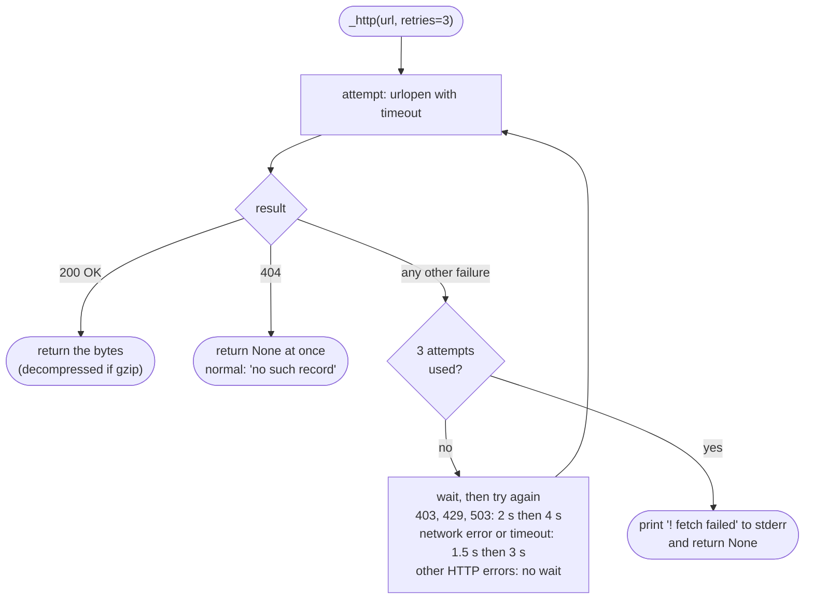
```mermaid
flowchart TD
    S(["_http(url, retries=3)"]) --> A["attempt: urlopen with timeout"]
    A --> B{"result"}
    B -->|"200 OK"| OK(["return the bytes<br/>(decompressed if gzip)"])
    B -->|"404"| N(["return None at once<br/>normal: 'no such record'"])
    B -->|"any other failure"| R{"3 attempts<br/>used?"}
    R -->|no| W["wait, then try again<br/>403, 429, 503: 2 s then 4 s<br/>network error or timeout: 1.5 s then 3 s<br/>other HTTP errors: no wait"]
    W --> A
    R -->|yes| F(["print '! fetch failed' to stderr<br/>and return None"])
```

Key behaviours:

- **404 is silent.** Most sources legitimately have no entry for most CVEs; that is "no data", not "error".
- **Failures never raise.** `_http` returns `None`, so one dead website cannot crash the run.
- Worst case for one URL is roughly `3 × timeout + sleeps` (e.g. about 95 s with a 30 s timeout).
- The tool **does not** send `Accept-Encoding: gzip` by default; only the Debian dump request asks for it
  (12 MB compressed vs. roughly 80 MB raw, per the code comment).

[`llm_chat`](cve_report.py#L279) is separate on purpose: it **does** raise (`SystemExit` with an actionable message),
because without the LLM there is no report to write and silently falling back would hide a configuration problem.

## 4.3 The cache

[`_cached(name, ttl, producer)`](cve_report.py#L320) wraps the three big downloads.

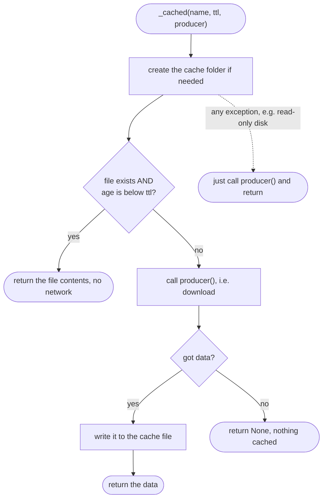
```mermaid
flowchart TD
    A(["_cached(name, ttl, producer)"]) --> B["create the cache folder if needed"]
    B --> C{"file exists AND<br/>age is below ttl?"}
    C -->|yes| D(["return the file contents, no network"])
    C -->|no| E["call producer(), i.e. download"]
    E --> F{"got data?"}
    F -->|yes| G["write it to the cache file"]
    G --> H(["return the data"])
    F -->|no| I(["return None, nothing cached"])
    B -.->|"any exception, e.g. read-only disk"| J(["just call producer() and return"])
```

| Cache file | TTL | Why cached |
|---|---|---|
| `kev.json` | 6 h | The KEV catalogue is one file for all CVEs |
| `debian_tracker.json` | 24 h | No per-CVE endpoint exists; the dump is large |
| `linux_kernel_cves.json` | 24 h | One ~6 MB file for all CVEs |

To force fresh data: `rm -rf "${TMPDIR:-/tmp}/cve_report_cache"`.

## 4.4 Building the CVE-list URL

CVE records live in folders grouped by year and by "thousands bucket". [`_cve_parts`](cve_report.py#L340) computes the bucket:

```text
CVE-2026-53359      year = 2026   number = 53359   bucket = number without last 3 digits + "xxx" = 53xxx
CVE-2026-100234     year = 2026   number = 100234  bucket = 100xxx
CVE-2026-512        year = 2026   number = 512     bucket = 0xxx      (3 digits or fewer)

https://raw.githubusercontent.com/CVEProject/cvelistV5/main/cves/2026/53xxx/CVE-2026-53359.json
```

[`cvelist_url`](cve_report.py#L349) gives the raw-file URL; [`cvelist_blob_url`](cve_report.py#L357) gives the human-readable
GitHub page that is added to the References section.

## 4.5 The fetchers, one by one

### Return-value convention (important when modifying code)

Most fetchers return **`None`** for *both* "nothing found" and "could not reach". Two families keep the two apart:

| Function | Success | Reached, but nothing found | Could not reach |
|---|---|---|---|
| [`fetch_exploitdb`](cve_report.py#L501) | list of rows | `[]` | `None` |
| [`fetch_wp_coverage`](cve_report.py#L513), [`fetch_hackernews_coverage`](cve_report.py#L536) | list of hits | `[]` | `None` |
| everything else | dict / text | `None` | `None` |

`build_record` uses the difference to write accurate "not included" reasons and to print "no coverage found" vs. nothing.

### The core fetchers

| Function | Request | Notes |
|---|---|---|
| [`fetch_cvelist`](cve_report.py#L369) | GitHub raw file, then `cveawg.mitre.org/api/cve/<id>` | Validates that `cveMetadata.cveId` equals the requested ID because the raw CDN "can serve stale blobs" (see diagram below) |
| [`fetch_dyad`](cve_report.py#L391) | `…/vulns.git/plain/cve/published/<year>/<ID>.dyad` | Only called when `is_kernel` |
| [`fetch_nvd`](cve_report.py#L400) | `services.nvd.nist.gov/rest/json/cves/2.0?cveId=<ID>` | Adds `apiKey` header if `NVD_API_KEY` is set; returns `vulnerabilities[0].cve` |
| [`fetch_epss`](cve_report.py#L410) | `api.first.org/data/v1/epss?cve=<ID>` | Returns `{"epss": "0.0017…", "percentile": "0.062…", "date": …}` — strings, converted with `float()` when rendered |
| [`fetch_kev`](cve_report.py#L418) | CISA JSON feed (cached 6 h) | Downloads the whole catalogue, scans `vulnerabilities[]` for `cveID` |

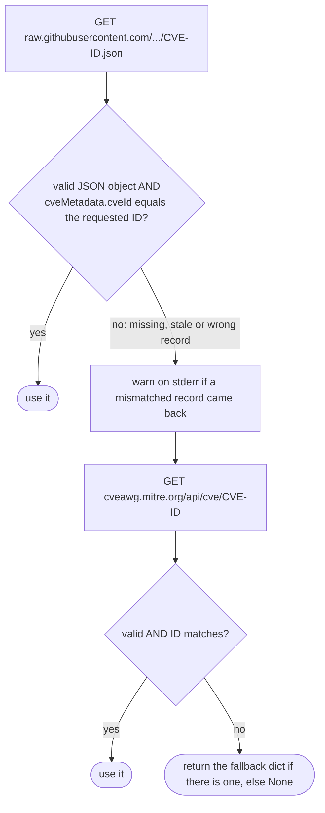
```mermaid
flowchart TD
    A["GET raw.githubusercontent.com/.../CVE-ID.json"] --> B{"valid JSON object AND<br/>cveMetadata.cveId equals the requested ID?"}
    B -->|yes| OK(["use it"])
    B -->|"no: missing, stale or wrong record"| C["warn on stderr if a mismatched record came back"]
    C --> D["GET cveawg.mitre.org/api/cve/CVE-ID"]
    D --> E{"valid AND ID matches?"}
    E -->|yes| OK2(["use it"])
    E -->|no| F(["return the fallback dict if there is one, else None"])
```

### Vendor and community fetchers

| Function | What it does | Gotchas |
|---|---|---|
| [`fetch_debian_entry`](cve_report.py#L480) | Downloads (cached) the whole Debian tracker JSON, looks under package `linux` first, then every package | The only way — Debian has no per-CVE endpoint |
| [`fetch_linuxkernelcves`](cve_report.py#L464) | Downloads (cached) the community JSON, returns `data[cve_id]` | Docstring: "community-maintained, no accuracy guarantee" |
| [`fetch_exploitdb`](cve_report.py#L501) | `exploit-db.com/search?cve=<ID>` with header `X-Requested-With: XMLHttpRequest` | Endpoint is undocumented; the code relies on it returning JSON |
| [`fetch_tuxcare`](cve_report.py#L559) | Regex 1: embedded `const allData = [...]` → Debian *ELS* fixes with status `released`. Regex 2: the "KernelCare state" HTML table → KCARE fixes | The most fragile fetcher — it reads HTML structure |
| Red Hat / Arch / OSV | [`fetch_redhat`](cve_report.py#L434), [`fetch_archlinux`](cve_report.py#L441), [`fetch_osv`](cve_report.py#L457) | Written and documented but **never called** |

### Media fetchers

| Function | Technique | Returns |
|---|---|---|
| [`fetch_feedly`](cve_report.py#L621) | Extract the `<script id="__NEXT_DATA__">` JSON from the page; keep CVSS estimate, `trending`, `patched`, total mentions and ≤ 5 article links (noisy hosts removed) | dict or `None` |
| [`fetch_hackerwire`](cve_report.py#L594) | Extract the `application/ld+json` block and read the `TechArticle` node. The site returns HTTP 200 even for unknown CVEs, so *no ld+json block* means "not tracked" | dict or `None` |
| [`fetch_hackernews_coverage`](cve_report.py#L536) | Blogger feed search `…/feeds/posts/default?q=<term>&alt=json`; tries the CVE ID, then the colloquial name | list / `[]` / `None` |
| [`fetch_wp_coverage`](cve_report.py#L513) | WordPress REST `…/wp-json/wp/v2/posts?search=<term>`; same two-term logic | list / `[]` / `None` |

> **Important about media results.** They are **keyword searches**, so a hit means "an article mentions that text", not
> "an article about this vulnerability". In the real sample run, Feedly's list included unrelated vendor bulletins and a
> SecurityOnline hit titled for a different CVE. Treat section 9 as leads, never as evidence.

## 4.6 Reading a commit: local first, network second

The tool needs, for each relevant commit: author, **commit date**, subject, body, changed files, +/− line counts, and
the names of changed functions. [`fetch_patch`](cve_report.py#L758) tries two paths.

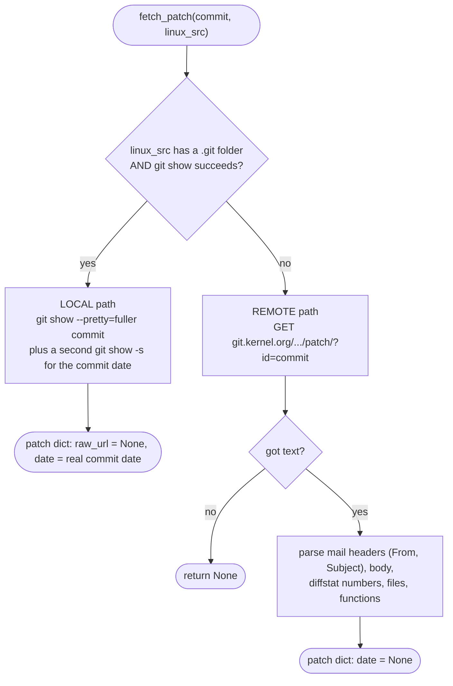
```mermaid
flowchart TD
    A(["fetch_patch(commit, linux_src)"]) --> B{"linux_src has a .git folder<br/>AND git show succeeds?"}
    B -->|yes| C["LOCAL path<br/>git show --pretty=fuller commit<br/>plus a second git show -s for the commit date"]
    C --> D(["patch dict: raw_url = None, date = real commit date"])
    B -->|no| E["REMOTE path<br/>GET git.kernel.org/.../patch/?id=commit"]
    E --> F{"got text?"}
    F -->|no| G(["return None"])
    F -->|yes| H["parse mail headers (From, Subject), body,<br/>diffstat numbers, files, functions"]
    H --> I(["patch dict: date = None"])
```

**Why is the remote `date` left empty?** The patch e-mail's `Date:` header is the *author* date (when the change was
first written). The tool's rule (stated in the README) is to report the **commit date** only, and that is available only
from a git tree. So if a commit is not in your local clone, its date is blank rather than wrong.

**How "changed functions" are guessed.** Git prints, after each hunk's `@@ … @@`, the nearest preceding "function
context" line. The tool reads those for `.c`/`.S` files only:

```text
@@ -1234,7 +1234,9 @@ static struct kvm_mmu_page *kvm_mmu_get_child_sp(struct kvm_vcpu *vcpu,   ← illustrative
 └── line ranges ──┘   └───────────── text after the second @@: git's guess of the function ─────────────┘
```

[`_func_from_context`](cve_report.py#L822) takes the first identifier followed by `(` that is not an ALL-CAPS macro and
not matched by `NOT_A_FUNCTION`. The result is a *hint*: the report marks it "derived from diff — approximate" whenever the
CNA did not list the functions itself.

## 4.7 Turning raw data into facts

### The dyad file → per-branch fix table

A real `.dyad` file (CVE-2026-53359):

```text
# dyad version: 1.2.0
# 	getting vulnerable:fixed pairs for git id 81ccda30b4e83d8f5cc4fd50503c44e3a33abfeb
2.6.36:2032a93d66fa…:5.15.222:0b5e8ead71e6…
2.6.36:2032a93d66fa…:6.1.177:b1337aae5e19…
2.6.36:2032a93d66fa…:6.6.144:9291654d69e0…
2.6.36:2032a93d66fa…:6.12.95:2ad3afa40ac6…
2.6.36:2032a93d66fa…:6.18.38:5e470998a23e…
2.6.36:2032a93d66fa…:7.1.3:1ae7d5a6db6c…
2.6.36:2032a93d66fa…:7.2:81ccda30b4e8…
```

Each line is `vulnerable version : vulnerable commit : fixed version : fixed commit` (hashes shortened here with `…`). The last
line's fixed commit equals the commit named in the header, so that pair is the **mainline** fix.

- [`parse_dyad`](cve_report.py#L1064) reads the **mainline commit** from the header (`pairs for git id <hash>`), then every
  non-comment line with exactly four `:`-separated fields.
- [`versions_from_dyad`](cve_report.py#L1091) classifies each pair:

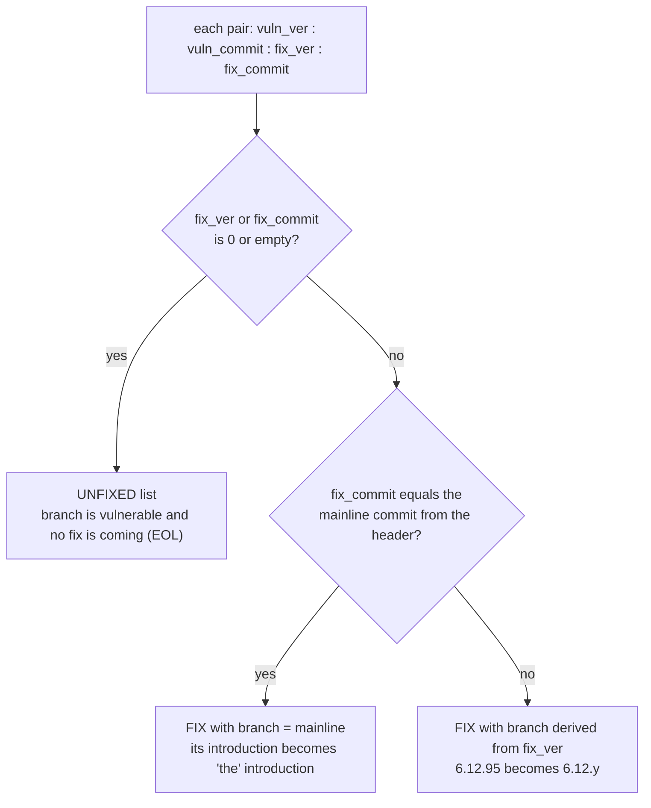
```mermaid
flowchart TD
    A["each pair: vuln_ver : vuln_commit : fix_ver : fix_commit"] --> B{"fix_ver or fix_commit<br/>is 0 or empty?"}
    B -->|yes| U["UNFIXED list<br/>branch is vulnerable and no fix is coming (EOL)"]
    B -->|no| C{"fix_commit equals the<br/>mainline commit from the header?"}
    C -->|yes| M["FIX with branch = mainline<br/>its introduction becomes 'the' introduction"]
    C -->|no| S["FIX with branch derived from fix_ver<br/>6.12.95 becomes 6.12.y"]
```

- Fixes are sorted **mainline first, then stable branches from newest to oldest**.
- `intro_backported` collects any *other* introduction versions (cases where the bug was copied into older stable branches by
  a back-port).

Visually, for the sample CVE:

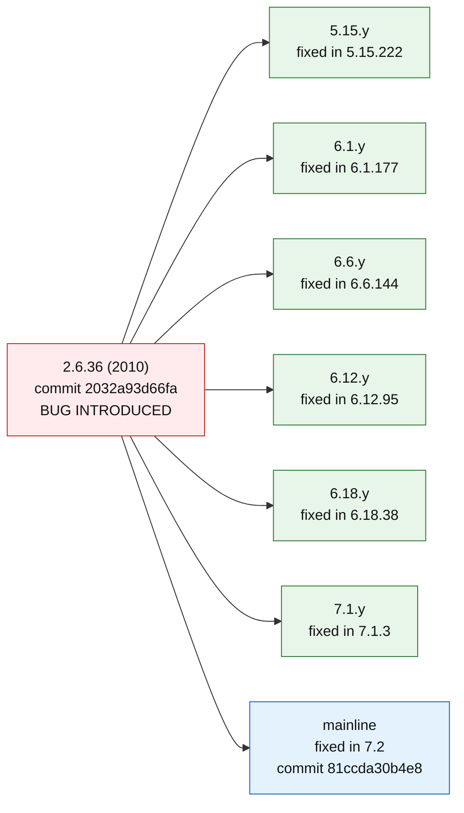
```mermaid
flowchart LR
    I["2.6.36 (2010)<br/>commit 2032a93d66fa<br/>BUG INTRODUCED"]:::bad
    I --> F1["5.15.y<br/>fixed in 5.15.222"]:::ok
    I --> F2["6.1.y<br/>fixed in 6.1.177"]:::ok
    I --> F3["6.6.y<br/>fixed in 6.6.144"]:::ok
    I --> F4["6.12.y<br/>fixed in 6.12.95"]:::ok
    I --> F5["6.18.y<br/>fixed in 6.18.38"]:::ok
    I --> F6["7.1.y<br/>fixed in 7.1.3"]:::ok
    I --> F7["mainline<br/>fixed in 7.2<br/>commit 81ccda30b4e8"]:::main

    classDef bad fill:#ffebee,stroke:#c62828,color:#111
    classDef ok fill:#e8f5e9,stroke:#2e7d32,color:#111
    classDef main fill:#e3f2fd,stroke:#1565c0,color:#111
```

**Why not just read the CVE record?** The record stores versions and commits as *parallel lists*, and the code comments
(and README) explain that zipping them by position breaks when a CVE has EOL branches, back-ports of the bug, or an unequal
number of commits vs. version ranges. The dyad file states each pairing explicitly, so it is used whenever it exists.
[`versions_from_record`](cve_report.py#L1135) is only a fallback and deliberately does **not** attempt per-branch pairing.

### CVSS

[`parse_cvss`](cve_report.py#L1158) collects scores from three places and **keeps them separate, labelled by source**:

1. the CNA container — `CNA (Linux)`,
2. each ADP container — `ADP (CISA-ADP)`,
3. NVD — `NVD (<source>)` (metric keys `cvssMetricV40/V31/V30/V2`).

Within each metric it looks for `cvssV4_0`, `cvssV3_1`, `cvssV3_0`, `cvssV2_0`. Duplicates (same version **and** vector)
are removed, first occurrence wins. The template renderer shows the first entry as *the* CVSS and lists differing others as
"CVSS (alt)".

### CWE: official data only, in a fixed order

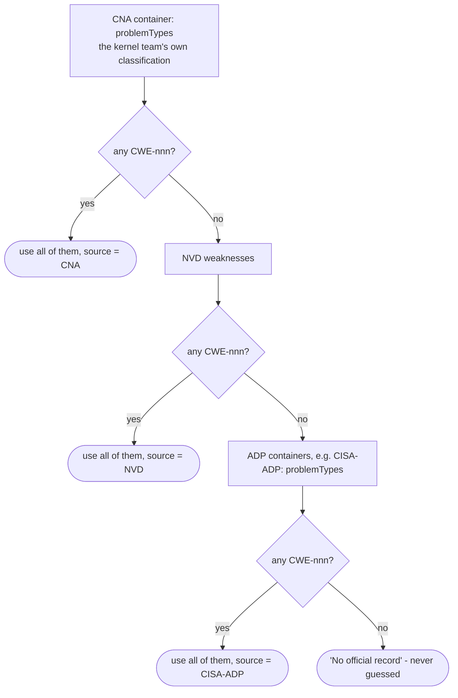
```mermaid
flowchart TD
    A["CNA container: problemTypes<br/>the kernel team's own classification"] --> B{"any CWE-nnn?"}
    B -->|yes| R1(["use all of them, source = CNA"])
    B -->|no| C["NVD weaknesses"]
    C --> D{"any CWE-nnn?"}
    D -->|yes| R2(["use all of them, source = NVD"])
    D -->|no| E["ADP containers, e.g. CISA-ADP: problemTypes"]
    E --> F{"any CWE-nnn?"}
    F -->|yes| R3(["use all of them, source = CISA-ADP"])
    F -->|no| R4(["'No official record' - never guessed"])
```

The first source with *any* CWE wins, and **all** of that source's CWEs are listed (e.g. `CWE-362, CWE-416`) together with the
source name. There is a keyword-guessing helper (`classify_cwe`) in the file, but `parse_cwe` intentionally no longer calls it.

### SSVC, CPE, references, titles

| Function | Behaviour |
|---|---|
| [`parse_ssvc`](cve_report.py#L1249) | Finds an ADP metric whose `other.type == "ssvc"`; returns `exploitation`, `automatable`, `technical_impact`, `role` and the publisher |
| [`parse_cpe_ranges`](cve_report.py#L1341) | Walks `cpeApplicability → nodes → cpeMatch` in CNA **and** ADP containers; keeps `vulnerable: true` ranges with inclusive/exclusive bounds; de-duplicates |
| [`categorize_refs`](cve_report.py#L1368) | Sorts every reference URL into `commits` / `cve_records` / `discussion` / `advisories` / `other` by hostname or path keyword (e.g. `git.kernel.org` → commits, `openwall.com` → discussion) |
| [`derive_subsystem`](cve_report.py#L1393) | Takes the leading `Name:` parts of the title (each ≤ 25 chars): `KVM: x86: Fix …` → `KVM: x86`; falls back to the first file's directory |
| [`_title_from_desc`](cve_report.py#L1409) | Kernel descriptions begin `…has been resolved:` + blank line + commit subject; the subject becomes the title |
| [`summarize_debian`](cve_report.py#L1287), [`summarize_exploitdb`](cve_report.py#L1324) | Reduce big source objects to the few fields the report needs |

## 4.8 "Which module is this?" — two mechanisms

| | `fetch_makefile_config` | `resolve_modules_by_branch` |
|---|---|---|
| Where it reads | **git.kernel.org** (Makefile of the file's directory, then its parent) | **Your local clone**, per branch, in a temporary worktree |
| Branch awareness | None — reads the **default branch** (current development tree) | Yes — `linux-5.10.y`, `linux-6.1.y`, `linux-6.12.y` |
| Uses your `.config`? | No | **Yes** — decides built-in vs. module vs. not compiled |
| Method | Regex heuristics over Makefile lines (`foo-y`, `foo-objs`, `obj-$(CONFIG_X) += foo.o`) | `find_module_new.py` — a dedicated Makefile + Kbuild + Kconfig resolver |
| Output | `modules`, `config`, `makefiles` | `module_by_branch` |
| Reliability | Best effort ("heuristic") | The rigorous one for your fleet |

[`resolve_modules_by_branch`](cve_report.py#L944) in detail:

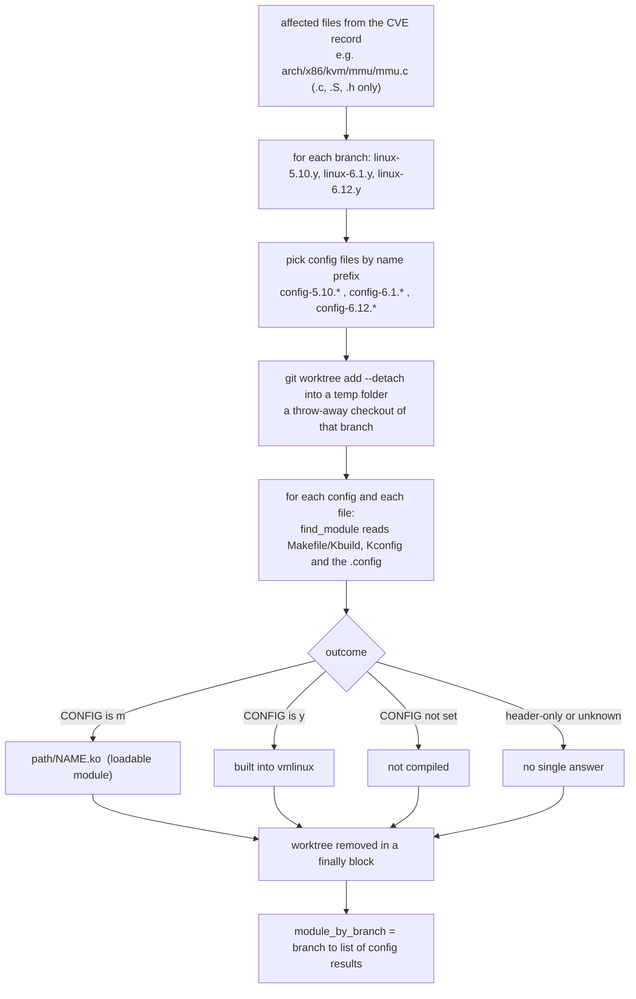
```mermaid
flowchart TD
    A["affected files from the CVE record<br/>e.g. arch/x86/kvm/mmu/mmu.c (.c, .S, .h only)"] --> B["for each branch: linux-5.10.y, linux-6.1.y, linux-6.12.y"]
    B --> C["pick config files by name prefix<br/>config-5.10.* , config-6.1.* , config-6.12.*"]
    C --> D["git worktree add --detach into a temp folder<br/>a throw-away checkout of that branch"]
    D --> E["for each config and each file:<br/>find_module reads Makefile/Kbuild, Kconfig and the .config"]
    E --> F{"outcome"}
    F -->|"CONFIG is m"| G["path/NAME.ko  (loadable module)"]
    F -->|"CONFIG is y"| H["built into vmlinux"]
    F -->|"CONFIG not set"| I["not compiled"]
    F -->|"header-only or unknown"| J["no single answer"]
    G --> K["worktree removed in a finally block"]
    H --> K
    I --> K
    J --> K
    K --> L["module_by_branch = branch to list of config results"]
```

Result strings come from `format_outcome`, e.g. (real data for `net/ipv6/ah6.c`, `CONFIG_INET6_AH`):

| Branch | Config used | File | `CONFIG_` symbol | Result |
|---|---|---|---|---|
| `linux-5.10.y` | `config-5.10.106` / `.191` / `.226` | `net/ipv6/ah6.c` | `CONFIG_INET6_AH` | `net/ipv6/ah6.ko` |
| `linux-6.1.y` | `config-6.1.112` / `.123` | same | same | `net/ipv6/ah6.ko` |
| `linux-6.12.y` | `config-6.12.74` / `.90` | same | same | `net/ipv6/ah6.ko` |

> **Cost.** `cve_report.py` asks for a *full* checkout of each branch (it passes no sparse-checkout patterns), once per
> branch, one after another. This is expected to be the slowest optional step, which is why `--no-module-resolve` exists.
> If a run is killed hard (e.g. `kill -9`), a leftover worktree can remain: clean up with
> `git -C ~/Linux_Stable/linux worktree prune`.

## 4.9 Fleet exposure

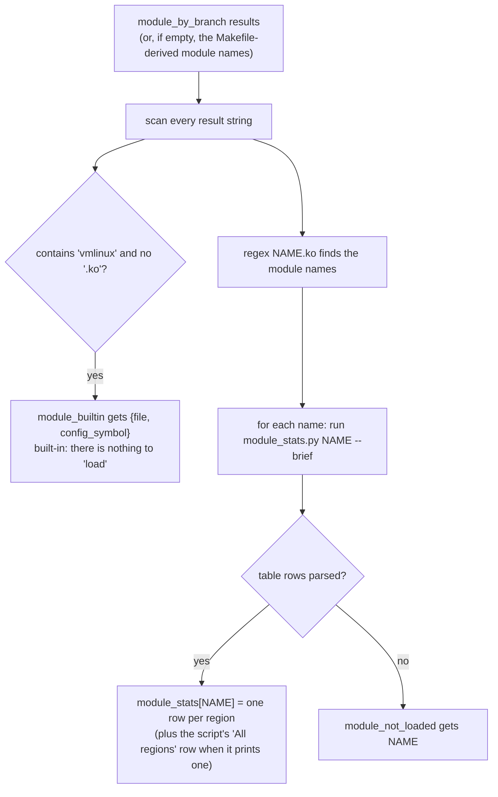
```mermaid
flowchart TD
    A["module_by_branch results<br/>(or, if empty, the Makefile-derived module names)"] --> B["scan every result string"]
    B --> C{"contains 'vmlinux' and no '.ko'?"}
    C -->|yes| D["module_builtin gets {file, config_symbol}<br/>built-in: there is nothing to 'load'"]
    B --> E["regex NAME.ko finds the module names"]
    E --> F["for each name: run module_stats.py NAME --brief"]
    F --> G{"table rows parsed?"}
    G -->|yes| H["module_stats[NAME] = one row per region<br/>(plus the script's 'All regions' row when it prints one)"]
    G -->|no| I["module_not_loaded gets NAME"]
```

[`fetch_module_stats`](cve_report.py#L910) parses the script's text table with a regex into rows with: region, total IPs,
loaded, ZServices, VMs, physical servers, KVM hosts, container hosts, containers.

The three outcomes are rendered differently:

| Outcome | Meaning for the reader |
|---|---|
| `module_builtin` | Compiled into `vmlinux`. **Every kernel built with that `CONFIG_` symbol contains the code.** Fleet module-load statistics do not apply |
| `module_stats` | Loadable module; here is where it is loaded |
| `module_not_loaded` | Not loaded in any region — so the fleet is not exposed *via that module* (but see the caveat in [5.8](#58-known-quirks-and-limitations-of-the-current-code), item 5) |

## 4.10 Assembling the record and the "not included" list

At the end of [`build_record`](cve_report.py#L1420):

1. **`sources_used`** is built from what actually produced data (e.g. `CISA KEV` vs. `CISA KEV (not listed)`;
   `local Linux source (…)` vs. `git.kernel.org (commits)`).
2. A `skipped` list pairs each unused source with a precise reason (`disabled (--no-vendor)`, `not a Linux kernel CVE`,
   `site unreachable`, …). It is printed to stderr — it is **not** in the data pack.
3. The big dict is returned.

## 4.11 Rendering

### Path A — the LLM (default): [`render_markdown_llm`](cve_report.py#L1838)

1. [`_slim_data_pack`](cve_report.py#L1790) shrinks the record to fit a budget (below).
2. The user message is the prompt template (`ZLLM_REPORT_USER_TEMPLATE`) with the CVE ID and the pretty-printed JSON inserted.
3. [`llm_chat`](cve_report.py#L279) POSTs `{"model", "temperature": 0.2, "messages": [system, user]}` to
   `<ZLLM_BASE_URL>/chat/completions` (180 s timeout).
4. The reply is checked: a `# Title` is added if missing, and a one-line `> Generated … · sources: …` banner is inserted
   under the title.

What the prompts tell the model:

| Rule | Purpose |
|---|---|
| "Use ONLY the facts present in that JSON — never invent CVE numbers, commits, versions, scores, or links" | Grounding / anti-hallucination |
| "If a field is missing or null, say so plainly" → write `Not available` / `Not yet assessed` | No guessing |
| Never mention "the JSON", "data pack", or field names | The output must read as an official advisory |
| Fixed section order 1–10 (with 3b, TuxCare subsection, per-branch module table, fleet table, backports table **with a date column**) | Consistent structure |
| Do **not** include Red Hat, Ubuntu, SUSE, Arch or OSV sections | Matches the product decision |
| List **all** CWE IDs and state their source | Transparency |

**Keeping the data pack within the proxy's content limit** — [`_slim_data_pack`](cve_report.py#L1790) works down a ladder and
stops as soon as the JSON fits in **350 000 characters**:

```mermaid
flowchart TD
    A["Start: patches slimmed<br/>bodies 1200 chars, file and function lists capped at 40"] --> B{"fits in 350,000 chars?"}
    B -->|yes| OK(["send"])
    B -->|no| C["Step 1: commit-message bodies cut to 300 chars"]
    C --> D{"fits?"}
    D -->|yes| OK
    D -->|no| E["Step 2: drop Feedly chatter, keep 1 hit per news site,<br/>keep only 5 'other' references"]
    E --> F{"fits?"}
    F -->|yes| OK
    F -->|no| G["Step 3: drop patch bodies completely"]
    G --> H{"fits?"}
    H -->|yes| OK
    H -->|no| I["Step 4: keep only the mainline and the introducing commit patches"]
    I --> OK2(["send, not re-checked"])
```

Core fields (CVSS, versions, description, module tables) are never trimmed.

### Path B — the template: [`render_markdown`](cve_report.py#L1858)

A plain Python function that appends lines to a list: a fixed layout with the same ten sections, no model, fully
predictable. Use it when the proxy is down, when you want byte-for-byte reproducibility, or as a **reference to compare an
LLM report against**.

## 4.12 `main()`

[`main`](cve_report.py#L2266) parses flags, validates the CVE ID, calls `build_record`, and then:

| Flag combination | Result |
|---|---|
| `--json-only` | Print the data pack to stdout, return 0 (no LLM call, no files) |
| `--template` | `render_markdown(record)` |
| *(default)* | `render_markdown_llm(record)` |
| `--stdout` | Print the report, write no report file |
| `-o PATH` | Write to `PATH` (default `<CVE>_report.md` in the current directory) |
| `--json` | **Additionally** write `<CVE>_data.json` in the current directory — even with `--stdout` |

**Exit codes:** `0` success · `1` fatal error (`SystemExit` with a message: CVE record not found, LLM problem) ·
`2` bad command line (argparse, including an invalid CVE ID).

---

# Part 5 — Advanced topics

## 5.1 Design principles (and why)

| Principle | How the code shows it | Why it matters |
|---|---|---|
| **Standard library only** | No `requests`, no `pip install` | Runs on any server with Python; one file is easy to audit and copy |
| **Authoritative first, fallbacks second** | cvelistV5 → cveawg; local git → git.kernel.org; CNA → NVD → ADP for CWE | Best data wins; the tool survives outages |
| **Validate what you fetched** | `fetch_cvelist` checks the returned `cveId` | A CDN can hand back the wrong blob |
| **Fail soft, except where failure means "no report"** | Fetchers return `None`; only the CVE record and the LLM are fatal | One flaky news site must not block a security report |
| **Never guess official classifications** | CWE: "No official record" rather than keyword inference; function names flagged "derived — approximate" | A wrong CWE looks authoritative; a visible gap does not |
| **Keep sources separate, label them** | Multiple CVSS entries each tagged with their source | Readers see disagreements instead of a silently merged number |
| **Say what was skipped, and why** | The `- not included:` console list; the Provenance section | Absence of a section is explainable |
| **Separate data from prose** | Collect → JSON → render | Data is testable and auditable; renderers are swappable |
| **Ground the LLM** | System prompt restricts it to the data pack | Reduces (does not eliminate) invention |
| **Deterministic where possible** | Template renderer; temperature 0.2 | Reproducibility for the parts that can be reproducible |
| **No silent fallback from LLM to template** | `llm_chat` raises `SystemExit` | Prevents a user believing they got an LLM-written report when they did not |

## 5.2 The data pack schema

Top-level keys of the record returned by `build_record` (also what `--json` / `--json-only` emit):

| Key | Type | Meaning |
|---|---|---|
| `cve_id`, `title`, `description` | string | Identity and the upstream commit message |
| `assigner`, `is_kernel` | string, bool | CNA short name; `true` when it is `Linux` |
| `vendor`, `product`, `state` | string | From the CNA's `affected` block and metadata (`PUBLISHED`, …) |
| `published`, `updated`, `generated_at` | string | ISO dates from the record; UTC time of this run |
| `generator` | string | The tool that built the CVE record (e.g. `bippy-1.2.0`) |
| `subsystem` | string | Derived from the title or first file |
| `files`, `functions`, `functions_derived` | list, list, bool | Affected files; changed functions; whether they were *derived* from the diff |
| `modules`, `config`, `makefiles` | lists | Makefile-heuristic results |
| `repos` | list | Source repo(s) from the record |
| `module_by_branch` | object | `{branch: [{config, files: [{file, config_symbol, result}]}]}` |
| `module_stats` | object | `{module: {module, rows: [{region, total_ips, loaded, zservices, vms, phys_srv, kvm_host, cont_host, containers}]}}` |
| `module_not_loaded`, `module_builtin` | lists | See 4.9 |
| `cvss` | list | `[{version, vector, score, severity, source}]` |
| `cwe` | object | `{id, ids[], name, source, derived}` |
| `epss`, `kev`, `ssvc` | object / null | Raw EPSS row, the KEV entry (or `null`), parsed SSVC |
| `versions` | object | `source, intro_version, intro_commits[], intro_backported[], mainline_version, mainline_commit, fixes[], unfixed[]` (+ `affected_ranges[]` in fallback mode) |
| `cpe_ranges` | list | Vulnerable version ranges |
| `references` | object | `{commits, cve_records, discussion, advisories, other}` — lists of URLs |
| `patches` | object | `{commit_hash: {commit, web_url, author, date, subject, body, files[], functions[], insertions, deletions}}` |
| `sources_used` | list | Human-readable list of sources that produced data |
| `nvd_status` | string | `vulnStatus`, or `Not in NVD` |
| `exploitdb`, `debian`, `lkc`, `tuxcare` | list / object / null | Vendor and community results |
| `ubuntu_link` | string / null | Link only; `null` under `--no-vendor` (the template uses it as the "vendor skipped" flag) |
| `feedly`, `hackerwire`, `hackernews_coverage`, `cybersecuritynews_coverage`, `securityonline_coverage` | object / list / null | Media results (`null` = unreachable or not found; `[]` = searched, nothing found) |
| `qualys_blog_link`, `bleepingcomputer_search_link` | string / null | Link-only sources; `null` under `--no-media` |

A real `versions` block (abbreviated), from the repo's sample data:

```json
{
  "source": "kernel vulns.git dyad",
  "intro_version": "2.6.12",
  "intro_commits": ["1da177e4c3f41524e886b7f1b8a0c1fc7321cac2"],
  "intro_backported": [],
  "mainline_version": "7.3-rc1",
  "mainline_commit": "7bad4bda74dc4713f398d3b7624ff05478e3a568",
  "fixes": [
    { "commit": "7bad4bda…", "release": "7.3-rc1", "branch": "mainline", "is_mainline": true,
      "intro_version": "2.6.12", "intro_commit": "1da177e4…" },
    { "commit": "46640c81…", "release": "7.2.3", "branch": "7.2.y", "is_mainline": false, "…": "…" }
  ],
  "unfixed": []
}
```

## 5.3 Error handling model

| Situation | What the code does |
|---|---|
| Invalid CVE ID | `ap.error(…)` → exit 2 |
| CVE record unreachable / absent | `SystemExit("ERROR: could not fetch a record for …")` |
| Any other HTTP/network failure | `_http` returns `None`; warning on stderr (except 404); run continues |
| JSON that does not parse | The `_http_json` / fetcher returns `None` |
| Unexpected exception inside a *parser of third-party data* (TuxCare JSON, cache read) | Swallowed (`except Exception: pass`) → treated as "no data" |
| Cache folder unusable | `_cached` falls back to calling the downloader directly |
| `git show` fails or times out (30 s) | Local patch path returns `None` → remote path |
| `find_module_new` import fails | `resolve_modules_by_branch` returns `{}` |
| Worktree creation fails | That branch is skipped |
| `module_stats.py` fails, times out (60 s) or prints no table | `fetch_module_stats` returns `None` → recorded under `module_not_loaded` |
| LLM proxy: unreachable / HTTP error / empty reply | `SystemExit` with the server's message (first 500 chars) |

## 5.4 Performance and network cost

Everything runs **sequentially in one thread**, so wall time ≈ the sum of all request latencies plus git work.

| Group | Requests | Notes |
|---|---|---|
| Core | CVE record 1 (+1 fallback), dyad 1, NVD 1, EPSS 1, KEV 0–1 | KEV cached 6 h |
| Vendor | Exploit-DB 1, TuxCare 1, Debian 0–1 (cached 24 h), linuxkernelcves 0–1 (cached 24 h) | First run downloads ~12 MB + ~6 MB |
| Media | Feedly 1, Hacker Wire 1, Hacker News 1–2, CyberSecurityNews 1–2, SecurityOnline 1–2 | 2nd request only if the 1st search found nothing and a colloquial name exists |
| Patches | 0 network requests when commits are in the local clone; else 1 per commit | A CVE with 8 commits means 8 patches |
| Makefiles | 1–2 per compiled affected file | Always on for kernel CVEs with files |
| Module resolution | no network; heavy local disk work | Worktree checkouts |
| LLM | 1 POST, up to 180 s | |

A test run with `--template --no-module-resolve --no-module-stats` took **about 27 s** on the development machine.

Speed tips: `--no-media` (cuts ~6 requests), `--no-vendor`, `--no-diff`, `--no-module-resolve`; set `NVD_API_KEY`;
keep the cache warm when running many CVEs.

## 5.5 Security and privacy considerations

| Topic | Facts | Advice |
|---|---|---|
| **Command execution** | `subprocess.run` always receives an argument **list**; no `shell=True`. Commit IDs are validated against `^[0-9a-f]{8,40}$` before `git show`. Module names passed to `module_stats.py` come from a `[A-Za-z0-9_-]+` regex. | Keep it that way when editing |
| **Parsing untrusted web content** | HTML is handled with regex and `json.loads` only; nothing is executed or evaluated | Safe by construction; but regex parsers can silently mis-parse if a site changes layout |
| **What leaves your machine** | (1) Each GET reveals your IP and the CVE ID you are researching to ~15 third parties. (2) In default mode the **whole data pack** is POSTed to the zLLM proxy, which forwards to whatever upstream model it is configured for (`gpt-5.4` by default). The pack includes **fleet statistics** (per-region IP counts, ZService counts) when `module_stats.py` ran. | Confirm where your proxy sends data and whether that is acceptable for internal inventory numbers. If not, use `--template` or `--no-module-stats` |
| **Secrets** | `NVD_API_KEY` and `ZLLM_API_KEY` come from the environment; nothing is written to disk | Do not hard-code keys |
| **Executed file** | `--module-stats-script` is *run*. It is only checked with `os.path.isfile` | Point it only at a script you trust |
| **Temp files** | Cache and worktrees live under `$TMPDIR` | Use a private `TMPDIR` on shared hosts |

## 5.6 Extending the tool

### Recipe: add a new data source

1. **Fetcher** — one function that returns `None` / `[]` / data (follow the return convention in 4.5):

   ```python
   def fetch_example(cve_id):
       """Example.org: per-CVE JSON. 404 is normal for CVEs they do not track."""
       data = _http_json(EXAMPLE_API % cve_id, timeout=15)
       return data  # None when unreachable or not found
   ```
2. **Summariser (optional)** — trim the response to the few fields you need, like `summarize_debian`.
3. **Call it** in `build_record`, behind the right flag (`fetch_vendor` / `fetch_media`) and `is_kernel` check if relevant.
4. **Store it** in the returned dict under a new key.
5. **Declare it** — append to `sources_used` when it produced data, and add a `_skip(name, reason)` line when it did not.
6. **Render it** — add a block in `render_markdown` (template) *and* mention it in `ZLLM_REPORT_USER_TEMPLATE` (LLM), otherwise
   the model will not know to include it.
7. **Mind the size** — if the data can be large, trim it in `_slim_data_pack`.

> The three "unused" sources (Red Hat, Arch, OSV) already have steps 1–2 done; enabling one means steps 3–7.

### Other common changes

| Goal | Change |
|---|---|
| Resolve modules for another kernel branch | Add it to `MODULE_RESOLVE_BRANCHES`; create a local branch of that name in the Linux clone; add `configs/config-<major.minor>.<patch>` files |
| Use a different LLM | Point `ZLLM_BASE_URL` / `ZLLM_MODEL` at any server that implements OpenAI-style `POST /chat/completions` |
| Change report wording or sections | Edit `ZLLM_REPORT_SYSTEM_PROMPT` / `ZLLM_REPORT_USER_TEMPLATE` (LLM) or `render_markdown` (template) |
| Cache another large download | Wrap its `_http` call in `_cached(name, ttl, producer)` |
| Lift the 350 000-character limit | Change `ZLLM_MAX_DATA_PACK_CHARS` (only if the proxy allows it) |

## 5.7 Troubleshooting

| Symptom | Likely cause | Fix |
|---|---|---|
| `ERROR: could not reach zLLM proxy … Is the proxy running?` | Proxy not started, or wrong `ZLLM_BASE_URL` | `zllm start`, or use `--template` |
| `ERROR: zLLM request failed (4xx …)` | Request rejected, often content too large | Re-run with `--no-media`; check `ZLLM_MAX_DATA_PACK_CHARS` vs. the proxy's limit |
| `ERROR: could not fetch a record for CVE-…` | Typo, CVE not yet published, or no network | Check the ID on cve.org; check connectivity |
| `! fetch failed: <url> (HTTP Error 429 …)` | Rate-limited (commonly NVD) | Set `NVD_API_KEY`; wait and retry |
| `not included: Per-branch module resolution (local Linux source tree not available)` | `--linux-src` wrong | Pass the correct clone path |
| `… (no matching .config files or find_module_new.py unavailable)` | Config files not named `config-<major.minor>.<patch>`, or `find_module_new.py` not beside the script | Rename files; run the script from its own folder |
| Commit dates blank | Commit not present in the local clone | `git fetch` in the clone (stable branches included) |
| Report says a module is "not loaded" but you expect it is | `module_stats.py` may have failed or timed out (see 5.8, item 5) | Run `module_stats.py <module> --brief` by hand |
| Stale Debian / KEV / community data | Cache TTL | `rm -rf "${TMPDIR:-/tmp}/cve_report_cache"` |
| First run very slow | Debian dump (~12 MB gz) and linuxkernelcves (~6 MB) downloading | Wait; later runs use the cache |
| Leftover `find_module_wt_*` folders in `$TMPDIR` | A run was killed hard | `git -C <clone> worktree prune`, then delete the folders |

## 5.8 Known quirks and limitations of the current code

These were found while reading the code against its own comments and README. None of them stops the tool working; they are
listed so nobody is surprised.

| # | Observation | Effect |
|---|---|---|
| 1 | **Unused code:** `fetch_redhat`, `fetch_archlinux`, `fetch_osv`, `summarize_redhat/archlinux/osv`, `classify_cwe`, `CWE_KEYWORDS`, the `SUSE_CVE_PAGE` constant; the `title` and `desc` parameters of `parse_cwe` | Dead weight; also why the file's top docstring lists sources that the report never shows |
| 2 | The **module docstring** lists Red Hat / Arch / OSV / Ubuntu / SUSE as sources, and the `--no-vendor` help text says it skips "Red Hat/Debian/Arch/OSV/Exploit-DB" | Misleading. In reality `--no-vendor` skips **Exploit-DB, Debian, linuxkernelcves and TuxCare** (the README is correct) |
| 3 | `_func_from_context` comments say "last identifier before `(`" but the code returns the **first** acceptable one | Function names are hints either way |
| 4 | The set of commits to fetch is a Python `set`, so iteration order can vary between runs | Only matters when the mainline patch yields no function names: *which other patch* supplies them may differ run to run |
| 5 | `fetch_module_stats` returns `None` for **script missing, crash, timeout, or "module not tracked"**, and `build_record` puts every `None` in `module_not_loaded` | A failed or slow stats script can be reported as "not loaded in any region". Verify surprising negatives by hand |
| 6 | `fetch_makefile_config` reads the **default branch** of the stable tree, not the affected branch | It can disagree with the per-branch table; trust the per-branch table |
| 7 | Remote patches carry no date (author date ≠ commit date) | Dates are blank for commits absent from the local clone |
| 8 | `--stdout` does not suppress `--json` | `<CVE>_data.json` is still written |
| 9 | If both the raw GitHub file and cveawg return something that does not match the requested ID, the fallback dict is still returned | Very unlikely; the report would describe the wrong record |
| 10 | `_slim_data_pack` does not re-check the size after its last step | An enormous pack could still be rejected by the proxy |
| 11 | `build_record`'s fatal path and `llm_chat` raise `SystemExit` rather than a normal exception | Importing the functions into other code needs `try/except SystemExit` |
| 12 | The README calls the script "deterministic"; that is true of the data collection and the `--template` output, **not** of LLM prose | Do not diff LLM reports byte-for-byte |
| 13 | `.claude/commands/cve.md` runs `python3 /Users/gowtham-23345/CVE_Report/cve_report.py` — a macOS-style path | On this Linux machine the repo is at `/home/gowtham-23345/CVE_Report`; the `/cve` command would need that path updated |
| 14 | In template mode the introducing commit's date is printed in git's raw format (`Sun Aug 1 10:35:52 2010 +0300`) while other dates are `YYYY-MM-DD` | Cosmetic |

---

# Part 6 — Official sources and reliability

## 6.1 The trust model

The tool does not treat all sources equally. In decreasing order of authority:

```mermaid
flowchart TB
    T1["TIER 1 - Primary and authoritative<br/>CVE record (cvelistV5, cveawg)<br/>kernel.org dyad file - git.kernel.org commits"]:::t1
    T2["TIER 2 - Official enrichment<br/>NVD (NIST) - EPSS (FIRST) - CISA KEV<br/>CISA-ADP data inside the CVE record"]:::t2
    T3["TIER 3 - Vendor and specialist trackers<br/>Debian Security Tracker - TuxCare - Exploit-DB"]:::t3
    T4["TIER 4 - Community dataset<br/>linuxkernelcves.com"]:::t4
    T5["TIER 5 - Media and aggregators (keyword matches)<br/>Feedly - Hacker Wire - The Hacker News<br/>CyberSecurityNews - SecurityOnline"]:::t5
    L["YOUR OWN INPUTS<br/>local Linux clone, configs/, module_stats.py<br/>authoritative for YOUR fleet, only as fresh<br/>and correct as the files you maintain"]:::loc

    T1 -->|"decreasing authority"| T2
    T2 --> T3
    T3 --> T4
    T4 --> T5
    T5 ~~~ L

    classDef t1 fill:#c8e6c9,stroke:#1b5e20,color:#111
    classDef t2 fill:#dcedc8,stroke:#33691e,color:#111
    classDef t3 fill:#fff9c4,stroke:#f9a825,color:#111
    classDef t4 fill:#ffe0b2,stroke:#e65100,color:#111
    classDef t5 fill:#ffcdd2,stroke:#b71c1c,color:#111
    classDef loc fill:#e3f2fd,stroke:#1565c0,color:#111
```

## 6.2 Source-by-source assessment

"Official" here means *the body that is the authority for that kind of information*. It does not mean the tool has been
endorsed by any of them.

| Source | Operated by | Official for… | Interface | Stability of the interface | Main failure mode | How the tool copes |
|---|---|---|---|---|---|---|
| **cvelistV5** | The CVE Program (the international program that governs CVE IDs; MITRE-operated, CISA-sponsored) | The CVE record itself | Raw JSON file | Stable path scheme | A CDN can return a stale or wrong blob | Validates `cveId`; falls back to cveawg |
| **cveawg.mitre.org** | The CVE Program | The CVE record (CVE Services API) | REST | Documented service | Outage | Only the fallback |
| **vulns.git dyad** | The kernel.org CNA team | Which commits introduce/fix a kernel CVE, per release | Plain text | Stable format (header version `1.2.0` seen) | File absent for older / non-kernel CVEs | Falls back to the record's ranges; says so in Provenance |
| **git.kernel.org** | kernel.org | The kernel source history | Plain/patch endpoints | Stable | Outage, rate limits | Prefers the local clone; retries |
| **NVD 2.0** | NIST (US government) | NVD's own CVSS/CWE/CPE analysis and status | REST (documented) | Versioned API | Rate limits; CVE not yet analysed | Optional key; shows status; CVSS also from CNA/ADP |
| **EPSS** | FIRST.org | The EPSS probability | REST (documented) | Documented | Outage; score missing for new CVEs | Row simply absent, logged |
| **CISA KEV** | CISA (US government) | The known-exploited list | Published JSON feed | Stable | Outage | Cached 6 h; "not listed" is shown explicitly |
| **Debian Security Tracker** | The Debian project | Debian's per-suite status | Published JSON dump | Stable | Large download | Cached 24 h |
| **TuxCare tracker** | TuxCare (commercial vendor) | *TuxCare's own* ELS / KernelCare status only | HTML (regex) | **Fragile** — breaks if the page layout changes | Silent mis-parse → "no entry" | Returns `None` when no Debian rows are found |
| **Exploit-DB** | OffSec | A widely used curated archive of public exploits (not an authority on whether a CVE is exploitable) | Undocumented AJAX endpoint | **Fragile** — undocumented | Header requirement; layout change | `None` (unreachable) vs. `[]` (no hit) kept distinct |
| **linuxkernelcves.com data** | Community maintainer | Nothing officially; useful cross-check | JSON file | Depends on the maintainer | **No accuracy guarantee** (stated in the code) | Shown only as "community cross-check" |
| **Feedly** | Feedly (commercial) | Nothing — an aggregator | JSON inside HTML | Fragile | Layout change; noisy chatter | Noisy hosts filtered; capped at 5 |
| **Hacker Wire / Hacker News / CyberSecurityNews / SecurityOnline** | Independent sites | Nothing — media | `ld+json`, Blogger feed, WordPress REST | Standard feeds, but search is keyword-based | Irrelevant hits | Only titles and links are shown, capped at 3 |
| **Local clone, `configs/`, `module_stats.py`** | You | Your own kernels and fleet | Files and a script | — | Outdated configs or inventory | Lists exactly which configs were used |
| **Not used:** Red Hat, Arch, OSV | Red Hat; Arch Linux; Google's open-source vulnerability project | — | — | — | — | Code exists, never called |

**Reachability check (documentation time, 2026-10-06).** From the machine hosting this repo, each of the endpoints above
returned HTTP 200 for `CVE-2026-53359`, except Arch (404 — expected, Arch tracks few CVEs, and the tool does not call it).
This was an HTTP-status check only; the content of most sources was exercised by the full run in
[Appendix C](#appendix-c--a-real-run-annotated). One request to `raw.githubusercontent.com` got no response within 15 s on the
first attempt and succeeded on the next — exactly the situation that `_http`'s retries and `fetch_cvelist`'s fallback exist
for. This is a point-in-time observation, not a guarantee.

## 6.3 What the tool does to protect accuracy

1. **Record validation** — the fetched CVE record's own ID must match the one requested.
2. **Explicit pairing from the kernel team** — versions/commits come from the dyad file, not from guessing across arrays.
3. **No hidden merging** — every CVSS score keeps its source label; the CWE keeps its source; NVD status is shown verbatim.
4. **No invented classification** — no CWE is guessed; derived function lists are labelled approximate.
5. **Cross-check labelling** — the community dataset is explicitly presented as a cross-check with "no accuracy guarantee".
6. **Provenance** — the report lists the sources that actually produced data (and shows "CISA KEV (not listed)" when it queried and found nothing).
7. **Accountability on stderr** — every unused source is listed with a reason.
8. **Grounded prose** — the LLM is instructed to use only supplied facts and to write "Not available" for gaps.

## 6.4 Verify any claim yourself

Every row of a report can be confirmed at its origin. Replace `CVE-2026-53359` with your ID (and `2026/53xxx` with its
year/bucket — see 4.4).

| Report field | Confirm at the official place | Command / link |
|---|---|---|
| Title, description, dates, state, CNA CVSS, files, functions | The CVE record | `curl -s https://cveawg.mitre.org/api/cve/CVE-2026-53359` · https://www.cve.org/CVERecord?id=CVE-2026-53359 |
| Introduced / fixed commits and releases | The kernel team's dyad file | `curl -s https://git.kernel.org/pub/scm/linux/security/vulns.git/plain/cve/published/2026/CVE-2026-53359.dyad` |
| NVD status, NVD CVSS/CWE | NVD | `curl -s "https://services.nvd.nist.gov/rest/json/cves/2.0?cveId=CVE-2026-53359"` · https://nvd.nist.gov/vuln/detail/CVE-2026-53359 |
| EPSS | FIRST | `curl -s "https://api.first.org/data/v1/epss?cve=CVE-2026-53359"` |
| KEV "listed / not listed" | CISA | `curl -s https://www.cisa.gov/sites/default/files/feeds/known_exploited_vulnerabilities.json \| grep -c CVE-2026-53359` |
| Commit author, date, diff | git.kernel.org / your clone | `https://git.kernel.org/stable/c/<sha>` · `git -C ~/Linux_Stable/linux show -s --format=%cd <sha>` |
| "Is this fix in release X?" | Your clone | `git -C ~/Linux_Stable/linux tag --contains <sha> \| sort -V \| head` |
| Debian status | Debian | https://security-tracker.debian.org/tracker/CVE-2026-53359 |
| Public exploit | Exploit-DB | https://www.exploit-db.com/search?cve=CVE-2026-53359 (in a browser) |
| Module / `CONFIG_` result | Your clone and `.config` | `python3 find_module_new.py arch/x86/kvm/mmu/mmu.c ~/Linux_Stable/linux --config configs/config-6.12.90 --branches origin/linux-6.12.y` (arguments per `--help`: files first, then the source tree; it uses a temporary worktree per branch) |
| Fleet numbers | The fleet script | `~/Server-Modules/Scripts/module_stats.py <module> --brief` |

The report's own **References** section already contains most of these links.

## 6.5 Reliability of the LLM step — and how to audit it

The LLM is the only non-deterministic, non-verifiable component. The script **does not check the generated text against the
data**. The mitigations are in the prompt (grounding, "Not available", temperature 0.2), not in code. To audit a report:

```bash
# 1. keep the facts alongside the prose
python3 cve_report.py CVE-2026-53359 --json            # writes CVE-2026-53359_report.md and CVE-2026-53359_data.json

# 2. every commit hash in the report must exist in the data pack
grep -oE '\b[0-9a-f]{12,40}\b' CVE-2026-53359_report.md | sort -u | while read h; do
  grep -q "$h" CVE-2026-53359_data.json || echo "NOT IN DATA PACK: $h"
done

# 3. compare against the deterministic rendering
python3 cve_report.py CVE-2026-53359 --template -o /tmp/template.md
diff <(grep -E 'CVSS|EPSS|NVD status' /tmp/template.md) <(grep -E 'CVSS|EPSS|NVD status' CVE-2026-53359_report.md)
```

(Step 2 was run against an existing LLM-written report in this repo and found 20 distinct hashes, all present in its data pack.)
Also spot-check scores, dates and fixed-release numbers in section 3, the most error-prone part to re-type.

## 6.6 What the report is **not**

- **Not a scan of your systems.** "Fleet exposure" reports *module-load statistics from an inventory*, not whether a specific
  host is exploitable.
- **Not proof of exploitability or safety.** CVSS, EPSS and SSVC are estimates by third parties.
- **Not a replacement for your patch policy.** Mitigation text is generic (update to a fixed release, migrate off EOL branches)
  unless the upstream description gives specifics.
- **Not an official publication of any listed organisation.** It is a compilation; the sources are the authority.

---

# Part 7 — Advantages, limits and when to use what

## 7.1 Advantages

| Advantage | Detail |
|---|---|
| **Saves time** | One command replaces roughly ten websites and a manual version-matching exercise |
| **Authoritative core** | CVE record, kernel.org dyad and git history are primary sources |
| **Kernel-accurate version mapping** | Uses the kernel team's explicit pairs; surfaces EOL branches that will never be fixed |
| **Fleet-aware** | Links CVE → file → `CONFIG_` → module → how many of *your* servers load it — something no public site can give |
| **Transparent** | Provenance section; per-source CVSS and CWE; a list of what was skipped and why |
| **Resilient** | Retries, fallbacks, caching, graceful degradation |
| **Zero install** | Standard library only; copy one file |
| **Flexible output** | Markdown (LLM or template) and JSON for automation |
| **Polite to servers** | Identifying User-Agent, caching of large dumps, sequential requests |
| **Extensible** | Clear collect → normalise → render split; recipe in 5.6 |

## 7.2 Limitations

| Limitation | Detail |
|---|---|
| Kernel-centric | Non-kernel CVEs lose the dyad, patches, modules and fleet sections |
| Depends on external sites | Layout/API changes can break the fragile fetchers (TuxCare, Exploit-DB, Feedly) |
| Media section is noisy | Keyword matching, not relevance checking |
| LLM output is not verified | See 6.5 |
| Per-branch resolution is limited to the configured branches and config files | Others are simply absent |
| Sequential and I/O-heavy | A full run is slower than a `--no-…` run; worktree creation dominates |
| Internal tooling assumptions | Paths and `module_stats.py` are specific to this environment |
| Known quirks | See 5.8 |

## 7.3 The script vs. the `/cve` command

| | `python3 cve_report.py …` | `/cve …` in Claude Code |
|---|---|---|
| What it is | The data engine plus an LLM-proxy or template writer | The same engine, then Claude reads the actual diffs and writes deeper analysis |
| Strengths | Fast, scriptable, batchable, runs unattended | Root-cause analysis, impact, exploitation discussion, a subsystem primer |
| Needs | Python (+ optional extras) | Claude Code session; the command file's script path must be valid (see 5.8, item 13) |
| Output | `<CVE>_report.md` (+ JSON) | An overwritten `<CVE>_report.md` with extra analysis sections |

---

# Appendix A — Command-line reference

```text
usage: cve_report.py [-h] [-o OUTPUT] [--stdout] [--json] [--json-only]
                     [--no-diff] [--no-vendor] [--no-media] [--template]
                     [--llm-model LLM_MODEL] [--linux-src LINUX_SRC]
                     [--configs-dir CONFIGS_DIR] [--no-module-resolve]
                     [--module-stats-script MODULE_STATS_SCRIPT]
                     [--no-module-stats]
                     cve
```

| Argument | Default | Effect | Sources affected |
|---|---|---|---|
| `cve` | required | CVE ID such as `CVE-2026-53359` (case-insensitive) | — |
| `-o`, `--output` | `<CVE>_report.md` | Report path | — |
| `--stdout` | off | Print the report, write no report file | — |
| `--json` | off | Also write `<CVE>_data.json` | — |
| `--json-only` | off | Print the data pack and exit | — |
| `--no-diff` | off | Do not fetch commit patches | Patches (dates, authors, derived functions) |
| `--no-vendor` | off | Skip vendor/community lookups | Exploit-DB, Debian, linuxkernelcves, TuxCare, `ubuntu_link` |
| `--no-media` | off | Skip media lookups | Feedly, Hacker Wire, Hacker News, CyberSecurityNews, SecurityOnline, Qualys/BleepingComputer links |
| `--template` | off | Use the built-in renderer | The LLM |
| `--llm-model` | `$ZLLM_MODEL` or `gpt-5.4` | Model id for the proxy | — |
| `--linux-src` | `~/Linux_Stable/linux` | Local Linux git clone | Local patches; module resolution |
| `--configs-dir` | `./configs` | Folder of `config-*` files | Module resolution |
| `--no-module-resolve` | off | Skip per-branch module table | `find_module_new.py` |
| `--module-stats-script` | `~/Server-Modules/Scripts/module_stats.py` | Fleet script path | Fleet exposure |
| `--no-module-stats` | off | Skip fleet exposure | `module_stats.py` |

**Files the tool reads or writes**

| Path | When | Purpose |
|---|---|---|
| `./<CVE>_report.md` (or `-o`) | Normal run | The report |
| `./<CVE>_data.json` | `--json` | The data pack |
| `$TMPDIR/cve_report_cache/{kev,debian_tracker,linux_kernel_cves}.json` | Vendor/KEV lookups | Download cache |
| `$TMPDIR/find_module_wt_<random>` | Module resolution | Temporary git worktree, removed afterwards |

**Examples**

```bash
python3 cve_report.py CVE-2026-53359                                  # LLM-written report
python3 cve_report.py CVE-2026-53359 --template --stdout              # print template report
python3 cve_report.py CVE-2026-53359 --json-only > pack.json          # facts only
python3 cve_report.py CVE-2026-53359 --no-media --no-module-resolve   # fast run
for c in CVE-2024-50264 CVE-2024-53104; do python3 cve_report.py "$c"; done   # batch
```

---

# Appendix B — Function index

Line numbers refer to commit `7e38fe1`.

| Function | Purpose |
|---|---|
| [`_http`](cve_report.py#L234) | GET with retries, gzip handling; returns bytes or `None` |
| [`_http_json`](cve_report.py#L264) / [`_http_text`](cve_report.py#L274) | Decode `_http` output |
| [`llm_chat`](cve_report.py#L279) | POST to the zLLM proxy; raises `SystemExit` on any failure |
| [`_cached`](cve_report.py#L320) | File cache with TTL |
| [`_cve_parts`](cve_report.py#L340) | Split a CVE ID into year / number / bucket |
| [`cvelist_url`](cve_report.py#L349), [`cvelist_blob_url`](cve_report.py#L357) | Raw-file and web-page URLs for the CVE record |
| [`fetch_cvelist`](cve_report.py#L369) | CVE record with validation and fallback |
| [`fetch_dyad`](cve_report.py#L391) | Kernel dyad text |
| [`fetch_nvd`](cve_report.py#L400), [`fetch_epss`](cve_report.py#L410), [`fetch_kev`](cve_report.py#L418) | NVD, EPSS, CISA KEV |
| [`fetch_redhat`](cve_report.py#L434), [`fetch_archlinux`](cve_report.py#L441), [`fetch_osv`](cve_report.py#L457) | **Unused** |
| [`fetch_linuxkernelcves`](cve_report.py#L464) | Community dataset entry |
| [`fetch_debian_entry`](cve_report.py#L480) | Entry from the cached Debian dump |
| [`fetch_exploitdb`](cve_report.py#L501) | Exploit-DB rows (`None` vs `[]`) |
| [`fetch_wp_coverage`](cve_report.py#L513) | WordPress REST search hits |
| [`fetch_hackernews_coverage`](cve_report.py#L536) | Blogger feed search hits |
| [`fetch_tuxcare`](cve_report.py#L559) | TuxCare Debian ELS and KernelCare fixes |
| [`fetch_hackerwire`](cve_report.py#L594), [`fetch_feedly`](cve_report.py#L621) | Embedded-JSON media sources |
| [`_unfold_headers`](cve_report.py#L661) | Re-join folded e-mail header lines |
| [`_fetch_patch_local`](cve_report.py#L673) | Patch details via `git show` |
| [`fetch_patch`](cve_report.py#L758) | Local-then-remote patch parser |
| [`_func_from_context`](cve_report.py#L822) | Guess a function name from a hunk header |
| [`fetch_makefile_config`](cve_report.py#L835), [`_makefile_for`](cve_report.py#L852) | Makefile-heuristic module and `CONFIG_` |
| [`_module_names_from_resolution`](cve_report.py#L892) | Collect `.ko` names from resolution results |
| [`fetch_module_stats`](cve_report.py#L910) | Run and parse `module_stats.py` |
| [`resolve_modules_by_branch`](cve_report.py#L944) | Per-branch, per-config module resolution |
| [`_dig`](cve_report.py#L1017) | Safe nested dict lookup |
| [`_sev_from_score`](cve_report.py#L1027), [`_branch_of`](cve_report.py#L1043) | Score → label; release → branch |
| [`classify_cwe`](cve_report.py#L1051) | Keyword CWE guesser — **unused** |
| [`parse_dyad`](cve_report.py#L1064), [`_ver_key`](cve_report.py#L1086), [`versions_from_dyad`](cve_report.py#L1091), [`versions_from_record`](cve_report.py#L1135) | Version/fix mapping |
| [`parse_cvss`](cve_report.py#L1158), [`parse_cwe`](cve_report.py#L1200), [`parse_ssvc`](cve_report.py#L1249), [`parse_cpe_ranges`](cve_report.py#L1341) | Record parsers |
| [`summarize_redhat`](cve_report.py#L1267), [`summarize_debian`](cve_report.py#L1287), [`summarize_archlinux`](cve_report.py#L1301), [`summarize_osv`](cve_report.py#L1312), [`summarize_exploitdb`](cve_report.py#L1324) | Reduce source data to report fields (Red Hat/Arch/OSV unused) |
| [`categorize_refs`](cve_report.py#L1368), [`derive_subsystem`](cve_report.py#L1393), [`_title_from_desc`](cve_report.py#L1409) | Reference sorting, subsystem and title heuristics |
| [`build_record`](cve_report.py#L1420) | **The orchestrator** — returns the data pack |
| [`_fmt_date`](cve_report.py#L1743), [`_fmt_date_hdr`](cve_report.py#L2249), [`_short`](cve_report.py#L1753) | Formatting helpers |
| [`_slim_patches`](cve_report.py#L1763), [`_slim_data_pack`](cve_report.py#L1790) | Shrink the pack for the LLM |
| [`render_markdown_llm`](cve_report.py#L1838), [`render_markdown`](cve_report.py#L1858) | The two renderers |
| [`main`](cve_report.py#L2266) | CLI entry point |

---

# Appendix C — A real run, annotated

Command (run on 2026-10-06):

```bash
python3 cve_report.py CVE-2026-53359 --template --no-module-resolve --no-module-stats --stdout
```

**Console (stderr), line by line**

| Line | What is happening |
|---|---|
| `[*] CVE-2026-53359: fetching cvelistV5 record ...` | `fetch_cvelist` — the one mandatory download |
| `[*] fetching dyad / NVD / EPSS / KEV ...` | Core facts: version pairs, scores, exploit probability, known-exploited status |
| `[*] fetching Exploit-DB ...` | Vendor group begins |
| `[*] fetching Debian tracker / linuxkernelcves.com (cached, first run may be slow) ...` | The two large cached dumps |
| `[*] fetching TuxCare tracker ...` | HTML source |
| `[*] fetching media/community coverage (...) ...` | The five media sources |
| `[*] fetching 8 commit patch(es) ...` | 1 introducing commit + 7 fix commits (6 stable + mainline) — read from the local clone |
| `[*] deriving module / CONFIG ...` | `fetch_makefile_config` against git.kernel.org |
| `- not included: Per-branch module resolution (disabled (--no-module-resolve))` | Skipped by flag; the reason is printed |
| `- not included: Red Hat … / Arch … / OSV.dev (not queried (excluded from reports by design))` | The three deliberately unused sources |
| `- not included: linuxkernelcves.com (CVE not present in community dataset)` | Queried, no entry — not an error |

**Report excerpt → where each row came from**

| Row | Value in the run | Source |
|---|---|---|
| Assigner (CNA) | `Linux` | CVE record → sets `is_kernel` |
| Published / Last updated | 2026-07-04 / 2026-10-03 | CVE record metadata |
| CVSS | **8.8 HIGH** (v3.1), `AV:L/AC:L/PR:L/UI:N/S:C/C:H/I:H/A:H`, *CNA (Linux)* | CNA container metrics |
| Weakness | `CWE-416` *(NVD)* | CNA gave none, so NVD was used (see 4.7) |
| EPSS | 0.17 % (6.2th percentile) | FIRST EPSS |
| CISA KEV | not listed | KEV catalogue searched, no match |
| CISA SSVC | Exploitation=**poc**, Automatable=no, Tech-impact=total | CISA-ADP block in the CVE record |
| NVD status | Modified | NVD `vulnStatus` |
| Public exploit | not listed on Exploit-DB | Exploit-DB returned `[]` |
| Subsystem | `KVM: x86` | Derived from the title |
| Module / config | `kvm.ko`, `CONFIG_KVM_X86` | Makefile heuristic (`arch/x86/kvm/Makefile`) |
| Function | `kvm_mmu_get_child_sp()` *(derived — approximate)* | Hunk header of the mainline patch |
| Introduced | 2.6.36, commit `2032a93d66fa` | dyad file |
| Fixed per branch | 5.15.222, 6.1.177, 6.6.144, 6.12.95, 6.18.38, 7.1.3, mainline 7.2 | dyad file; dates from the local clone |
| Debian | bookworm 6.1.177-1, trixie 6.12.95-1, sid / forky 7.1.3-1 | Debian Security Tracker |
| TuxCare | Debian12 KCARE FIX (Released), Debian13 (Planned) | TuxCare HTML table |
| CVE record generated by | `bippy-1.2.0` | `x_generator.engine` in the record |

---

# Appendix D — FAQ

**Does it work for non-kernel CVEs?** Partly. You still get the CVE record, scores, EPSS, KEV, NVD, Exploit-DB and media, but no
dyad file, patches, module resolution, Debian/TuxCare/linuxkernelcves or fleet exposure.

**Why does the report say "Not available" or "Not yet assessed"?** The data was missing (for instance NVD has not analysed the
CVE yet). The tool and the LLM are told not to guess.

**Why are there several CVSS scores?** The CNA, CISA-ADP and NVD can each publish a score. The tool shows them separately,
with sources, so disagreements are visible.

**A file says "built into vmlinux". Is the fleet safe because no module is loaded?** No — the opposite. Built-in code is part of
every kernel built with that `CONFIG_` symbol, so "module not loaded" does not apply.

**How fresh is the data?** Live on each run, except CISA KEV (cached 6 h) and the Debian and linuxkernelcves dumps (cached 24 h).

**Can I run it for many CVEs?** Yes (see the batch loop in Appendix A). The big dumps are shared through the cache. Set
`NVD_API_KEY` to avoid NVD rate limits.

**Can I use a different language model?** Yes: set `ZLLM_BASE_URL` / `ZLLM_MODEL` (or `--llm-model`) to any server that offers an
OpenAI-style `/chat/completions` endpoint.

**Is the report an official document?** No. It is a compilation of official and unofficial sources; Part 6 shows how to confirm any
statement at its origin.

**Where do I add Red Hat or OSV back?** The fetch/summarise functions exist already; follow the recipe in 5.6 (steps 3–7).

**Why does the script exit instead of falling back when the LLM proxy is down?** To avoid giving you a different style of report
without telling you. Add `--template` yourself when you want that.
